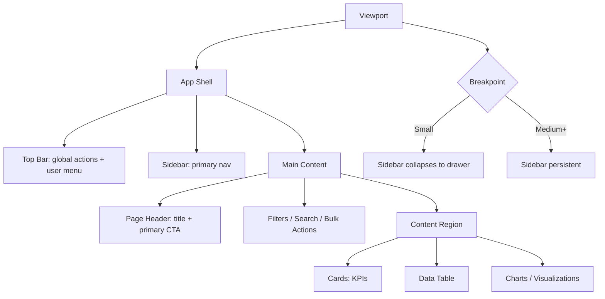

# Design Theory and Color Theory for Web Design for Admin Templates and Frontend Sites

## Executive Summary

Modern web UI quality is less about any single “look” and more about a repeatable **system**: hierarchy + layout rules + typography scale + color semantics + accessibility constraints + validation. When those pieces are explicit, teams can ship admin dashboards (high density, task-heavy) and user-facing sites (brand and narrative) with fewer regressions and more consistent usability. citeturn1search15turn2search2turn6search4

Across both admin and frontend work, the most reliable outcomes come from (a) deliberate **visual hierarchy** and Gestalt-informed grouping, (b) spacing and grids that create predictable scan paths, (c) typography tuned for readability and performance, and (d) color systems that are semantic, themeable, and contrast-valid. These are repeatedly emphasized in UX research and major platform/design-system guidance, and also align with accessibility conformance requirements for contrast, focus, and “not color alone.” citeturn1search15turn11search16turn6search4turn7search0

For **admin templates**, the dominant risk is “crowding” (too much information without structure) and “silent complexity” (tables, filters, and forms that aren’t keyboard/screen-reader robust). Guidance around density controls (e.g., row sizing), data table ergonomics, and ARIA patterns is especially relevant. citeturn3search1turn3search0turn3search16turn4search2turn4search0

For **frontend user-facing sites**, the dominant risk is “aesthetic-first breakage”: insufficient contrast, over-reliance on color to communicate, and large text surfaces that become hard to read because of line length, font loading shifts, or weak structure. Research-based guidance on line length and WCAG requirements for contrast and focus visibility are practical guardrails. citeturn6search1turn6search8turn6search4

The report includes: recommended spacing and type scales, two complete light/dark semantic palettes with contrast ratios, implementation patterns using tokens/CSS variables (plus Tailwind/Bootstrap examples), and a testing/validation toolbox (automated + manual). citeturn2search10turn8search1turn8search0turn2search3turn9search1

## Principles of Visual Design

Visual design principles—hierarchy, balance, contrast, alignment, and proximity—are best understood as **attention control**. They shape where eyes go first, what is grouped, and what is perceived as interactive or important. UX research on visual design and Gestalt principles highlights that “small” changes (alignment, spacing, contrast) can have outsized impacts on findability and comprehension. citeturn1search15turn1search27turn1search19turn6search8

**Hierarchy (what matters first).** Hierarchy is created by controlling a limited set of signals: size/scale, weight, contrast, spacing, and placement. A practical rule that works in both admin and frontend: each view should have (1) a single primary focal point, (2) a clear “next” action or section, and (3) supporting content that is visually quieter. Research and guidance on visual design testing stresses that hierarchy must be validated in context, not assumed. citeturn1search15turn11search16

**Balance (stable layouts, predictable scanning).** Balance is not symmetry; it is the sense that the page “settles.” For admin templates, balance often means stable columns and consistent density (tables/forms don’t randomly compress/expand). For frontends, balance is frequently achieved via larger whitespace regions and more deliberate content proportions (hero vs supporting sections). When balance is missing, users can perceive the UI as noisy, even if individual components look good. citeturn12search14turn6search8turn1search15

**Contrast (differentiation).** Contrast includes (a) luminance contrast for readability and accessibility, (b) contrast of size/weight for hierarchy, and (c) contrast of shape and boundary for interaction affordances. WCAG contrast requirements make this measurable for text and essential UI boundaries/focus indicators. citeturn6search4turn7search24turn13search10

**Alignment (structure is a usability feature).** Consistent alignment creates rhythm and reduces cognitive load—especially for admin UIs where users must compare rows/columns quickly. Grid-based alignment is repeatedly emphasized in layout guidance, including how gutters/margins structure content. citeturn12search14turn12search1turn12search2

**Proximity (grouping and chunking).** Proximity is one of the most reliable “low-effort, high-return” design moves: related items should be closer together than unrelated items. This aligns with Gestalt grouping and also improves scannability in complex pages (dashboards, settings screens). Chunking guidance highlights that good grouping plus whitespace improves processing, particularly for long or complex content. citeturn1search19turn6search8turn7search0

**Concrete example (admin vs frontend).**  
In an admin “Users” screen: putting table controls (search, filters, bulk actions) directly above the table and separated from page-level navigation by a larger spacing step uses proximity to clarify scopes. In a frontend “Pricing” page: grouping each plan’s price, features, and CTA inside a card with stronger visual boundaries makes comparison easier while keeping the CTA clearly primary. These are the same principles, tuned to different tasks and density. citeturn3search1turn13search1turn6search1

## Spacing, Grid Systems, and Responsive Layout

A robust layout system solves a recurring problem: **how to scale complexity without losing clarity**. Most mature systems standardize (1) a spacing scale, (2) a grid, and (3) breakpoint/container rules. Official guidance emphasizes columns/gutters/margins as foundational layout primitives. citeturn12search14turn12search1turn16search6turn16search0

**Spacing systems: baseline units and density.** Two widely used patterns are:
- An **8-unit baseline** with optional 4-unit adjustments (common in guidelines emphasizing an 8dp baseline grid). citeturn12search18turn12search14turn3search16  
- A **2x grid** approach (multiples of 2, 4, 8…) coupled to component tokens and density modes. citeturn3search9turn12search2turn12search5  

Admin work benefits from explicit density options: guidance on applying density notes that density is often adjusted by reducing component padding/height in consistent steps (e.g., 4dp). citeturn3search16turn3search24

### Recommended spacing scale (practical default)

The table below is a practical, code-friendly scale that supports both comfortable frontend spacing and denser admin layouts by choosing different tokens per component “density,” not by inventing new numbers ad hoc. The increments align with practices described in major spacing/density guidance. citeturn12search18turn3search9turn3search16

| Token | px | Typical use |
|---|---:|---|
| `space-0` | 0 | Reset / flush alignment |
| `space-1` | 4 | Tight icon gaps, compact table padding |
| `space-2` | 8 | Default small gaps, form internal spacing |
| `space-3` | 12 | Dense card padding, inline groups |
| `space-4` | 16 | Default card padding, section sub-spacing |
| `space-5` | 24 | Between form sections, dashboard card gaps |
| `space-6` | 32 | Major section breaks, hero-to-content |
| `space-7` | 48 | Page section spacing (frontend) |
| `space-8` | 64 | Large layout separation (frontend) |

**Rule of thumb:**  
- **Admin templates**: most intra-component spacing lives in `space-1` to `space-4`, with optional density toggles that shift usage down a step (e.g., `space-3 → space-2`). citeturn3search1turn3search16  
- **Frontend sites**: use `space-4` to `space-8` more often, but keep text measures and hierarchy stable (large whitespace without hierarchy still feels “empty”). citeturn6search1turn11search16turn1search15  

### Grid systems: columns, gutters, margins

**Column grids (template-driven).** A classical approach is a 12-column grid with gutters and responsive breakpoints; official docs show how grids define column count and gutter widths (e.g., 12 columns; gutter width value per framework). citeturn16search6turn16search2

**Gutters (content separation).** Layout guidance emphasizes that gutters separate columns and prevent content from visually merging; some systems hold gutter widths fixed within breakpoint ranges. citeturn12search1turn12search18turn12search2

**CSS Grid (content-driven).** For frontend card layouts and admin dashboard panels, CSS Grid excels at creating responsive compositions without excessive breakpoint logic—using `repeat(auto-fit, minmax(...))` patterns described in modern CSS grid guidance. citeturn2search1turn2search29turn2search5

### Recommended breakpoint and container defaults (anchored to common practice)

A pragmatic starting point is to adopt a well-documented breakpoint/container set (then adjust), rather than inventing breakpoints. For example, a common scheme uses: 576/768/992/1200/1400px tiers and container max-widths that step to 540/720/960/1140/1320px. citeturn16search6turn16search0turn16search17

| Tier | Min width | Typical container max-width |
|---|---:|---:|
| `xs` | 0 | fluid |
| `sm` | 576px | 540px |
| `md` | 768px | 720px |
| `lg` | 992px | 960px |
| `xl` | 1200px | 1140px |
| `xxl` | 1400px | 1320px |

These values are standard in widely used responsive grid documentation. citeturn16search6turn16search0turn16search17

### Content width and reading measure (frontend-critical)

For content-heavy frontend pages, controlling **line length** is a usability win. Large-scale testing and UX guidance commonly cite an optimal range around **50–75 characters per line** for body text; overly long lines reduce readability and increase avoidance/skimming. citeturn6search1turn6search8turn6search5

A durable implementation pattern is to cap article-like content areas with `max-width: 65ch` (or similar) and center them, while allowing background sections (heroes, full-width imagery) to remain fluid. citeturn6search1turn6search14

### Layout flow diagram (admin dashboard example)



This “app shell → page structure → dense content” decomposition matches how many admin templates remain coherent under responsive constraints. citeturn12search14turn3search1turn4search2

## Typography: Type Scales, Pairing, Performance, and Accessibility

Typography is simultaneously a **design** system and a **runtime** system. It must produce hierarchy, remain readable under user overrides, and behave well under font loading/performance constraints. Major guidance explicitly ties type styles to roles and hierarchy, and also highlights how line height relates to size and intended use. citeturn5search0turn5search32turn5search1

### Recommended type scales

A “single perfect scale” does not exist; admin and frontend often benefit from different defaults:

- **Admin templates** tend to be interaction-heavy and dense, so base sizes are often slightly smaller, with more restrained heading jumps and stable line heights for scanning. Density guidance emphasizes controlling perceived density via text and spacing. citeturn3search4turn3search16turn3search1  
- **Frontend sites** frequently include longform or marketing copy; readability benefits from slightly larger base sizes, generous line height, and strict line-length control. citeturn6search1turn6search5turn5search1  

A practical “admin-friendly” scale (root 16px, use `rem` in code):

| Role | rem | px | Typical use |
|---|---:|---:|---|
| `text-xs` | 0.75 | 12 | Table microcopy, helper text (use sparingly) |
| `text-sm` | 0.875 | 14 | Dense UI text, metadata |
| `text-base` | 1.0 | 16 | Default UI text |
| `text-lg` | 1.125 | 18 | Section headings in content areas |
| `text-xl` | 1.25 | 20 | Page titles in compact layouts |
| `text-2xl` | 1.5 | 24 | Marketing sub-hero headings |

The key is not the exact numbers, but that each step has a defined role; that approach matches how type tokens/roles are described in major typography guidance. citeturn5search32turn5search0turn5search4

### Line height, letter spacing, and the “text spacing” requirement

**Line height:** Typography guidance explicitly notes line height is directly connected to type size and is a core parameter of legibility. citeturn5search0turn5search25

**Accessibility-required resilience:** Success Criterion 1.4.12 requires that content remains usable if users increase text spacing—line height up to 1.5× font size, paragraph spacing up to 2× font size, letter spacing up to 0.12× font size, word spacing up to 0.16× font size. This is a “design under user override” constraint: components should not collapse, overlap, or hide content when spacing changes. citeturn1search20turn1search35

### Font pairing: system fonts, web-safe fallbacks, and variable fonts

**System UI fonts** reduce loading cost and usually provide excellent platform-native legibility. Modern CSS supports `system-ui` as a portable way to request the OS UI font. citeturn5search20

When brand requires custom fonts, the implementation must manage:
- **Discovery/loading** (`@font-face`) citeturn5search7  
- **Render behavior** (`font-display`, with explicit block/swap periods) citeturn5search3  
- **Layout stability** (reducing CLS via `size-adjust` / font metric matching) citeturn5search6turn5search10turn5search30  

Performance guidance explains web fonts can impact load and render time; incorrect loading or display strategy can contribute to layout shifts and poorer user experience. citeturn5search2turn5search10turn5search6

### Code example: a resilient font stack with safer loading behavior

```css
/* 1) Default: fast system font */
:root {
  --font-sans: system-ui, -apple-system, Segoe UI, Roboto, Arial, sans-serif;
}

/* 2) Optional brand font (self-hosted) */
@font-face {
  font-family: "BrandSans";
  src: url("/fonts/brand-sans.woff2") format("woff2");
  font-weight: 100 900; /* variable font axis (if applicable) */
  font-style: normal;
  font-display: swap;   /* avoid invisible text */
}

html {
  font-family: "BrandSans", var(--font-sans);
  line-height: 1.5;
}
```

This pattern aligns with guidance on `@font-face`, `font-display`, and web font optimization strategies. citeturn5search7turn5search3turn5search2

## Color Theory and Practical Color Systems

Color in web design has two overlapping jobs: (1) **aesthetics and brand meaning**, and (2) **functional signaling** (states, emphasis, affordances) that must remain visible and accessible in multiple modes and under different forms of color perception. UX guidance explicitly frames color as a way to enhance design, including harmonies and careful use. citeturn11search16turn7search0turn7search3

### Color models and modern CSS color capabilities

Web UIs most commonly operate in RGB-like models (hex, `rgb()`), plus designer-friendly transforms like `hsl()`. Modern CSS continues to expand color definitions and manipulation, including new notations and color concepts documented in the CSS Color Module Level 4 specification and related guidance. citeturn2search0turn2search12turn2search8

A practical implication: for palette generation and theming, perceptual-ish spaces (e.g., OKLab/OKLCH as they become supported) can make it easier to create **smooth ramps** (neutrals) and consistent contrast steps than purely naive RGB adjustments. citeturn2search12turn2search0

### Harmony rules (useful, but must be constrained by semantics and accessibility)

Common harmony rules include analogous, complementary, and triadic schemes; mainstream tools explicitly surface these rules as palette generation strategies. citeturn11search0turn11search16turn11search3

In web UI (especially admin), harmony rules are best treated as “seed ideas,” then reshaped into a **semantic palette**: primary, secondary, success, warning, danger, info, plus neutrals and surfaces. That framing matches the way major UI color systems describe meaningful application of color and specific roles. citeturn7search1turn7search13turn7search17

image_group{"layout":"carousel","aspect_ratio":"16:9","query":["color wheel complementary analogous triadic diagram","color harmony complementary triadic analogous chart","web ui light dark color palette swatches"],"num_per_query":1}

### Contrast ratios, “not color alone,” and practical consequences

**Contrast ratios:** WCAG 2.2 retains the well-known contrast thresholds: normal text requires 4.5:1 (AA) under 1.4.3, and non-text essential UI boundaries/states require 3:1 under 1.4.11. WCAG 2.2 also recommends adopting 2.2 as a conformance target because it adds important new criteria (including focus-related ones). citeturn6search4turn7search3turn7search36

**Not color alone:** 1.4.1 requires that color is not the only visual means of conveying information or distinguishing elements—critical for status badges, form errors, and charts. citeturn7search0turn7search24

**Color-vision considerations:** Platform/testing guidance suggests validating designs in grayscale or similar modes to detect unintended reliance on color and to ensure information is conveyed with additional cues (icons, shapes, labels). citeturn7search6turn7search2

### Sample semantic palettes with measured contrast ratios (light and dark)

The following palettes are designed for typical web UI needs (admin + frontend) and include recommended “on-*” text colors. Contrast ratios below are computed using the WCAG contrast formula and should be validated in context (because background blending, opacity, and typography size can change outcomes). WCAG is the governing reference for the thresholds. citeturn6search4turn7search3

#### Light palette (hex)

| Token | Hex |
|---|---|
| `bg` | `#FFFFFF` |
| `surface` | `#F8FAFC` |
| `text` | `#0F172A` |
| `textMuted` | `#334155` |
| `borderStrong` | `#64748B` |
| `primary` / `onPrimary` | `#2563EB` / `#FFFFFF` |
| `success` / `onSuccess` | `#15803D` / `#FFFFFF` |
| `warning` / `onWarning` | `#FBBF24` / `#0F172A` |
| `danger` / `onDanger` | `#DC2626` / `#FFFFFF` |
| `info` / `onInfo` | `#0E7490` / `#FFFFFF` |
| `focusRing` | `#6366F1` |

#### Dark palette (hex)

| Token | Hex |
|---|---|
| `bg` | `#0B1220` |
| `surface` | `#111827` |
| `text` | `#F9FAFB` |
| `textMuted` | `#CBD5E1` |
| `borderStrong` | `#64748B` |
| `primary` / `onPrimary` | `#60A5FA` / `#0B1220` |
| `success` / `onSuccess` | `#4ADE80` / `#0B1220` |
| `warning` / `onWarning` | `#FBBF24` / `#0B1220` |
| `danger` / `onDanger` | `#F87171` / `#0B1220` |
| `info` / `onInfo` | `#22D3EE` / `#0B1220` |
| `focusRing` | `#A5B4FC` |

#### Contrast checks for common pairings

WCAG-informed targets: **≥ 4.5:1 for normal text (AA)**; **≥ 3:1 for essential non-text UI boundaries**. citeturn6search4turn7search3turn6search2

| Pairing | Light ratio | Dark ratio |
|---|---:|---:|
| Primary text on background | 17.85:1 | 17.92:1 |
| Secondary text on background | 10.35:1 | 12.61:1 |
| Link/primary text on background | 5.17:1 | 7.36:1 |
| Primary button text on primary | 5.17:1 | 7.36:1 |
| Success button text on success | 5.02:1 | 10.74:1 |
| Warning badge text on warning | 10.69:1 | 11.22:1 |
| Danger button text on danger | 4.83:1 | 6.77:1 |
| Info button text on info | 5.36:1 | 10.36:1 |
| Focus ring vs background (non-text) | 4.47:1 | 9.39:1 |
| Input border vs surface (non-text) | 4.76:1 | 3.73:1 |

### Generating palettes: a repeatable method (semantic-first)

A repeatable palette method that scales across products is:

1) Define **primitives** (neutrals ramp, a small set of brand hues).  
2) Define **semantic roles** (primary/success/warning/danger/info) as aliases of primitives.  
3) Define **theme modes** (light/dark) by changing roles, not by changing every component.  

This approach matches both the “tokens and roles” framing prevalent in large-scale theming systems and the general principle of functional colors in public-sector design guidance. citeturn10search10turn7search3turn10search1turn2search10

### Code snippet: drop-in palette swatches (visual)

Paste into any HTML file to visually inspect the palette:

```html
<div style="font-family:system-ui;display:grid;gap:12px;grid-template-columns:repeat(auto-fit,minmax(220px,1fr))">
  <div>
    <h3>Light</h3>
    <div style="display:grid;gap:6px">
      <div style="background:#FFFFFF;padding:10px;border:1px solid #64748B">bg #FFFFFF</div>
      <div style="background:#F8FAFC;padding:10px;border:1px solid #64748B;color:#0F172A">surface #F8FAFC</div>
      <div style="background:#2563EB;color:#FFFFFF;padding:10px">primary #2563EB</div>
      <div style="background:#15803D;color:#FFFFFF;padding:10px">success #15803D</div>
      <div style="background:#FBBF24;color:#0F172A;padding:10px">warning #FBBF24</div>
      <div style="background:#DC2626;color:#FFFFFF;padding:10px">danger #DC2626</div>
      <div style="background:#0E7490;color:#FFFFFF;padding:10px">info #0E7490</div>
    </div>
  </div>

  <div>
    <h3 style="color:#F9FAFB">Dark</h3>
    <div style="display:grid;gap:6px;background:#0B1220;padding:12px;border-radius:8px">
      <div style="background:#111827;color:#F9FAFB;padding:10px;border:1px solid #64748B">surface #111827</div>
      <div style="background:#60A5FA;color:#0B1220;padding:10px">primary #60A5FA</div>
      <div style="background:#4ADE80;color:#0B1220;padding:10px">success #4ADE80</div>
      <div style="background:#FBBF24;color:#0B1220;padding:10px">warning #FBBF24</div>
      <div style="background:#F87171;color:#0B1220;padding:10px">danger #F87171</div>
      <div style="background:#22D3EE;color:#0B1220;padding:10px">info #22D3EE</div>
    </div>
  </div>
</div>
```

## UI Components and Patterns for Admin Templates and Frontend Sites

This section focuses on “what to design” differently. Many components exist in both contexts, but their **default density, interaction models, and error tolerance** diverge.

### Admin templates: tables, forms, dashboards, data visualization

**Data tables (core admin surface).** Official component guidance describes data tables as a desktop-enterprise staple designed for scanning raw data; row sizing and header sizing are specified in major guidelines, and some systems explicitly provide multiple row sizes (extra small → extra large) to manage density and content types. citeturn12search7turn3search0turn3search1turn3search13

Key admin table patterns that scale:
- **Density modes**: offer row-size/density toggles rather than forcing one density; density guidance treats this as a controlled reduction of padding/height. citeturn3search16turn3search1turn3search24  
- **Toolbars and global actions**: reserve table toolbars for global operations (search, bulk actions, export); guidance warns against cramped placement and highlights spacing considerations. citeturn3search1turn3search21  
- **Avoid tables inside cramped containers/modals** when possible; component guidance explicitly warns against placing data tables in small containers where truncation and cramped scanning occur. citeturn3search17turn3search1  

**Forms (the second admin pillar).** Admin systems are often form-driven (create/edit workflows). Pattern guidance emphasizes clear validation and error message placement, and warns against relying on color alone for errors. citeturn3search2turn7search0turn12search16

**Dashboards (multi-surface composition).** Dashboards combine cards, grids, tables, and charts. Elevation/surfaces guidance describes how layered surfaces and elevation cues help structure content regions, which is especially important when dashboards become multi-panel. citeturn13search0turn13search4turn13search28

**Data visualization (colors, accessibility, redundancy).** Public guidance on chart colors stresses that color can clarify but can also confuse, and suggests using accessible palettes for categorical/sequential data. Combined with WCAG’s “not color alone,” this implies charts should also use labels, shapes/markers, or patterns—especially when color encodes meaning like “good/bad.” citeturn7search15turn7search0turn7search16

**Interactive “data grid” vs HTML table.** ARIA guidance defines an interactive grid as a composite widget with arrow-key navigation; it’s appropriate for spreadsheet-like interaction, not just display. Accessibility experts warn that using ARIA grid where a semantic `<table>` would suffice can become an anti-pattern and increase complexity. citeturn4search2turn4search17turn4search34

### Frontend sites: navigation, cards, dialogs/modals

**Navigation.** Accessible navigation typically relies on semantic HTML (`<nav>`, lists) and careful keyboard interaction. Guidance notes ARIA can do more harm than good if used unnecessarily, and MDN explicitly warns that the ARIA `menu` role is for application-style action menus, not generic site navigation. citeturn4search31turn4search16turn13search13

**Cards (content grouping).** Cards are described in component documentation as flexible content containers for grouping related content and actions. For frontend, cards often become the primary unit of “scan and choose” (features, pricing, listings). Card patterns should keep a clear internal hierarchy: heading → summary → actions. citeturn13search1turn13search19turn13search8

**Dialogs and modals (high-risk for accessibility regressions).** ARIA Authoring Practices specify that modal dialogs contain their tab sequence (Tab/Shift+Tab do not move focus outside), and typical best practice includes returning focus to the opener on close. Modern HTML also provides a native `<dialog>` element with `showModal()` for modal behavior. citeturn4search0turn14search2turn14search19turn14search24

## Accessibility, Implementation Guidance, and Testing/Validation

Accessibility is not a separate “phase”; it is the set of constraints that prevents design polish from breaking real-world usability. WCAG 2.2 adds new focus-related success criteria and recommends adopting 2.2 as a target. citeturn6search4turn6search3turn6search2

### Accessibility essentials that directly shape design decisions

**Contrast.** Ensure text meets contrast minimums and ensure essential UI cues (borders, focus indicators, icons that convey meaning) meet non-text contrast expectations. Some public-sector design guidance explicitly ties color contrast to WCAG 2.2 conformance. citeturn7search3turn6search4turn7search11

**Focus states.** WCAG’s focus visibility requirement ensures users can tell what has keyboard focus; WCAG 2.2 adds “focus not obscured” to reduce failures caused by sticky headers, overlays, etc. citeturn6search2turn6search3turn6search4

**Text spacing resilience.** SC 1.4.12 means layouts must not collapse when users increase spacing. This affects form layouts, table headers, and dense admin screens. citeturn1search20turn1search35

**Not color alone.** Status, error states, and charts must use additional cues beyond color. Platform evaluation criteria and WCAG both emphasize this through testing guidance and normative requirements. citeturn7search0turn7search6turn7search24

### Implementation: design tokens, CSS variables, Tailwind/Bootstrap patterns

A scalable implementation should separate:
- **Primitives** (raw values: ramps, font families, spacing numbers)  
- **Semantic tokens** (meaning: `color.text`, `color.border.strong`, `color.status.success`)  
- **Component tokens** (specific use: `button.primary.bg`, `table.row.height`)  

The idea of tokens as vendor-agnostic exchangeable design decisions is formalized by the entity["organization","Design Tokens Community Group","w3c community group"], including a defined file format for exchanging tokens across tools. citeturn2search2turn2search10turn2search6

#### Example: CSS variables + theme switching

```css
/* Base tokens */
:root {
  --space-1: 4px;
  --space-2: 8px;
  --space-4: 16px;

  --radius-2: 8px;

  /* Light theme roles */
  --color-bg: #ffffff;
  --color-surface: #f8fafc;
  --color-text: #0f172a;
  --color-text-muted: #334155;
  --color-border-strong: #64748b;
  --color-primary: #2563eb;
  --color-on-primary: #ffffff;
  --color-focus: #6366f1;
}

/* Dark theme roles */
[data-theme="dark"] {
  --color-bg: #0b1220;
  --color-surface: #111827;
  --color-text: #f9fafb;
  --color-text-muted: #cbd5e1;
  --color-border-strong: #64748b;
  --color-primary: #60a5fa;
  --color-on-primary: #0b1220;
  --color-focus: #a5b4fc;
}

body {
  background: var(--color-bg);
  color: var(--color-text);
}

.button-primary {
  background: var(--color-primary);
  color: var(--color-on-primary);
  padding: var(--space-2) var(--space-4);
  border-radius: var(--radius-2);
  border: 1px solid transparent;
}

.button-primary:focus-visible {
  outline: 3px solid var(--color-focus);
  outline-offset: 2px;
}
```

This design reflects best practices of expressing theming via CSS custom properties and toggling modes via a root attribute or media query. citeturn4search3turn4search10turn2search23

#### entity["organization","Tailwind CSS","utility-first css"] examples (token-driven theming)

Tailwind supports dark mode via a `dark` variant (often class-based) and—especially in newer approaches—exposes design tokens as CSS variables that utilities can consume, including defining tokens using `@theme`. citeturn8search1turn8search0turn8search11

```css
@import "tailwindcss";

@theme {
  --color-primary: #2563eb;
  --color-surface: #f8fafc;
}

/* Use: bg-primary text-white, etc. */
```

citeturn8search0

#### entity["organization","Bootstrap","css framework"] examples (color modes + CSS variables)

Bootstrap 5.3 supports color modes (including dark mode) with a `data-bs-theme` attribute and a Sass mixin (`color-mode()`) for generating mode-specific styles. It also exposes many CSS variables (prefixed by default) for runtime customization. citeturn2search3turn17search0turn2search23turn17search1

```html
<html data-bs-theme="dark">
  <!-- ... -->
</html>
```

```scss
@include color-mode(dark) {
  .my-card {
    background-color: var(--bs-body-bg);
    color: var(--bs-body-color);
  }
}
```

citeturn2search3turn17search7

### Comparison table: design systems and tools

The entries below are included because they are commonly used reference points for UI decisions, tokenization, accessibility posture, and implementation patterns.

| System/tool | What it is | Strengths for admin templates | Strengths for frontend sites | Tokens / theming signal |
|---|---|---|---|---|
| entity["book","Web Content Accessibility Guidelines 2.2","w3c rec 2024"] | Accessibility standard | Clear conformance targets for dense UIs | Prevents aesthetic-driven failures | Contrast + focus criteria |
| entity["book","ARIA Authoring Practices Guide","wai guidance"] | ARIA patterns + examples | Crucial for grids, dialogs, composite widgets | Crucial for menus/dialogs used as widgets | Prescribes keyboard models |
| entity["organization","Storybook","ui component workshop"] | Component workbench | Great for testing admin component states | Great for documenting frontend components | a11y addon uses axe-core |
| entity["organization","Style Dictionary","design token build tool"] | Token transformer/build system | Multi-platform token export | Same | Supports DTCG direction |
| entity["organization","Tokens Studio","figma token plugin"] | Token authoring in design | Bridges design→code token workflows | Same | Exports token JSON |
| entity["company","Figma","design software company"] | Design + variables/modes | Tokens/modes for UI variants | Tokens/modes for themes | Variables + modes for tokens |

Sources for the table include official documentation on WCAG 2.2, ARIA APG patterns, Storybook accessibility testing, Style Dictionary positioning, Tokens Studio documentation, and Figma’s variables guidance. citeturn6search4turn4search4turn15search0turn15search1turn15search2turn15search33

### SCSS patterns: maps for scalability (framework-neutral)

A common SCSS pattern for scalable design foundations is to centralize values in maps and generate utilities/variants via loops—similar to how component variants are generated in some frameworks. citeturn8search8turn13search23

```scss
$space: (
  0: 0,
  1: 4px,
  2: 8px,
  3: 12px,
  4: 16px,
  5: 24px,
  6: 32px
);

@each $k, $v in $space {
  .p-#{$k} { padding: $v; }
  .gap-#{$k} { gap: $v; }
}
```

citeturn8search8turn13search23

### Testing and validation methods (design + code)

A mature workflow uses **layered validation**:

**Automated checks (fast feedback).**
- Use Lighthouse audits for accessibility signals and regression prevention (including CI usage). citeturn9search1turn9search27  
- Use axe-based tooling for automated rule checks; axe-core is explicitly positioned for integration into functional tests. citeturn9search9turn9search15turn9search28  
- Use evaluation tools like WAVE for visual feedback and issue surfacing, while recognizing automation is incomplete. citeturn9search5turn9search7turn9search13  

**Component-level accessibility testing.**
- Storybook’s a11y addon is built on axe-core and is designed to run checks on component stories (useful for both admin and frontend component libraries). citeturn15search0turn15search6  

**Accessibility tree assertions (structure regression testing).**
- Playwright supports ARIA snapshots (a serialized accessibility tree) that can be stored and compared to detect structural regressions. citeturn9search2turn9search16  

**Manual checks (must-have).**
- Keyboard-only walkthroughs to verify focus order, focus visibility, “focus not obscured,” and dialog focus containment are essential; APG dialog patterns specify expected keyboard behavior. citeturn6search2turn6search3turn4search0  
- “Not color alone” checks: verify status, error, and chart meaning remains clear in grayscale or under color-deficiency simulation guidance. citeturn7search0turn7search6turn7search15  

**Visual design testing (behavioral).**
- UX research guidance emphasizes that visual design must be tested because subtle visual changes can alter user behavior; use usability testing, preference testing, and A/B methods as appropriate for the product stage and risk profile. citeturn1search15turn11search16