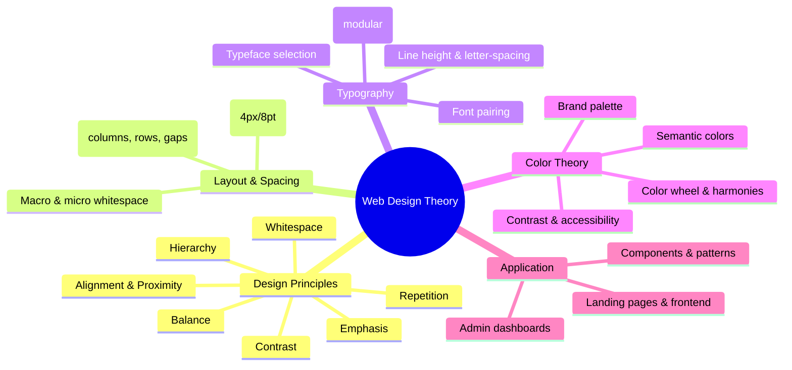
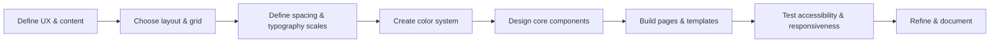

Below is a structured, research‑based overview of design theory and color theory for web design, with spacing, typography, and concrete focus on admin templates and frontend design.

---

## 1. Big picture: how the pieces fit together

For any web project—admin template or public frontend—good design comes from:

1. Core design principles (hierarchy, balance, contrast, etc.).
2. A layout & spacing system (grids + spacing scale).
3. A typography system (type scale, line height, pairing).
4. A color system (brand palette + semantic functional colors).
5. Application patterns specific to dashboards vs. marketing/landing pages.

---

## 2. Core design principles for web interfaces

Classic design principles translate almost 1:1 to UI. Multiple sources summarize similar sets: contrast, balance, emphasis, proportion, hierarchy, repetition, rhythm, pattern, white space, movement, variety, and unity【turn0search0】【turn0search2】. NN/g highlights scale, visual hierarchy, balance, contrast, and Gestalt as key for visual design in UX【turn0search1】.

### 2.1 Visual hierarchy

Visual hierarchy is the arrangement of elements by importance using size, color, contrast, spacing, and alignment【turn0search3】.

**How to use it:**

- **Size:** Larger = more important. Primary headings > subheadings > body text.
- **Color & contrast:** Brighter / higher-contrast elements draw attention.
- **Position:** Top-left in LTR languages gets more attention.
- **Spacing:** More space around an element increases its prominence.

For admin templates, hierarchy is critical: key metrics (KPIs) should be visually stronger than secondary stats.

### 2.2 Balance & layout

Balance is the sense of stability; it can be symmetrical or asymmetrical【turn0search0】.

- **Symmetrical:** More formal, stable, often used for dashboards and admin layouts.
- **Asymmetrical:** More dynamic, used for marketing landing pages to create tension/focus.

### 2.3 Contrast

Contrast is difference between elements: light vs dark, big vs small, filled vs outline【turn0search0】【turn0search1】.

- Use strong contrast for:
  - Primary buttons vs secondary actions.
  - Selected nav item vs others.
  - Text vs background (accessibility).

### 2.4 Emphasis & focal points

Emphasis is about creating a focal point【turn0search0】.

- In dashboards: a main KPI or chart at the top, or a highlighted “Needs attention” metric.
- In landing pages: hero headline + primary CTA.

### 2.5 Repetition, rhythm, and consistency

Repetition of styles (colors, typography, spacing) creates rhythm and unity【turn0search0】【turn0search2】.

- Repeat:
  - Button styles.
  - Card paddings and border radius.
  - Spacing increments (e.g., always 8px, 16px, 24px gaps).

This is especially important in admin templates where many similar screens (lists, forms, dashboards) must feel coherent.

### 2.6 Alignment & proximity (Gestalt)

Gestalt principles describe how we perceive groups: aligned or close items are seen as related【turn0search1】.

- **Alignment:** Lines of text, inputs, and icons should align to a grid.
- **Proximity:** Group related controls (filters + table), and put distance between groups.

### 2.7 Whitespace (negative space)

Whitespace is empty space around and between elements【turn0search0】. Research shows it improves comprehension, reduces cognitive load, and makes designs feel higher-quality【turn1search10】【turn1search12】.

Two main types【turn1search12】:

- **Macro whitespace:** Large margins between sections; page gutters.
- **Micro whitespace:** Line height, paragraph spacing, space inside buttons, between label and input.

---

## 3. Layout & spacing systems for web UI

### 3.1 Grid-based layout

Modern web layout uses CSS Grid and Flexbox with a column-based grid【turn1search15】【turn1search16】.

Common patterns:

- **12-column grid:** Standard for responsive web design; allows easy divisions (1/2, 1/3, 1/4).
- **Responsive layout grid:** Adapts columns and margins per breakpoint (e.g., 4 columns mobile, 8 tablet, 12 desktop)【turn1search16】.

Material Design’s responsive layout grid is a canonical example【turn1search16】.

### 3.2 Spacing scales & the 8pt/4pt system

Design systems (e.g., Atlassian) use a **base unit** of 8px or 4px for spacing【turn1search5】【turn1search6】.

- **8pt grid:** All padding/margin and often element sizes are multiples of 8 (8, 16, 24, 32, 40, 48…)【turn1search0】【turn1search3】.
- **4pt half-step:** For tighter spacing (icons, small text blocks)【turn1search4】.

Advantages:

- Consistency across the UI.
- Easier communication with devs (use tokens like `spacing-sm`, `spacing-md`).
- Better scaling on different screen densities (avoids half-pixels)【turn1search0】.

**Practical scale example (4pt base):**  
`4, 8, 12, 16, 24, 32, 48, 64, 96`【turn1search6】【turn1search8】.

### 3.3 Applying spacing to admin vs. frontend

- **Admin templates (dense UI):**
  - Use tighter spacing but still consistent.
  - Favor 4px base for dense tables and forms, 8px for overall layout.
  - Use more micro whitespace inside tables/cells than macro whitespace between major sections.

- **Marketing/frontend:**
  - More generous macro whitespace (big margins, section gaps).
  - Use larger base (8px) and larger step (32, 48, 64px) to create “breathing room”.

---

## 4. Typography system for web UI

Typography is the art of arranging type to make content legible, readable, and hierarchical【turn0search11】.

### 4.1 Key concepts

- **Legibility:** How easily individual characters can be distinguished【turn0search11】.
- **Readability:** How easily whole blocks of text can be read【turn0search11】.
- **Hierarchy:** Visual order of text elements (H1 > H2 > H3 > body)【turn0search11】.
- **Consistency:** Repeating same type styles across screens【turn0search11】.

### 4.2 Typeface selection

For UI, typically:

- **Sans-serif** for body text (e.g., Inter, system-ui, -apple-system, Roboto, Open Sans).
- **Optional serif or display font** for branding/hero headlines.

Consider:

- x-height (larger x-height is more legible at small sizes).
- Open apertures (e.g., letters like ‘a’, ‘e’, ‘c’).
- Support for the languages/character sets you need.

### 4.3 Type scale (modular scale)

A **type scale** is a progression of font sizes based on a ratio (e.g., 1.25, 1.333)【turn0search14】【turn0search11】.

Example (major third ≈ 1.25):

- `12px` – small / caption
- `14px` – body small
- `16px` – body (base)
- `20px` – H4
- `25px` – H3
- `31px` – H2
- `39px` – H1

This creates consistent hierarchy and rhythm【turn0search11】【turn0search14】.

### 4.4 Line height, letter-spacing, and paragraph spacing

- **Line height (leading):** Material Design recommends line heights proportional to type size【turn0search13】.
  - Typical range: 1.4–1.6 for body text.
  - Tighter (1.2–1.3) for large headings.
- **Letter-spacing:** Slightly increase for uppercase and small text; reduce for very large display text.
- **Paragraph spacing:** Typically 0.75–1.25 × font size【turn0search12】.

### 4.5 Font pairing

Common safe patterns:

- **Sans-serif body + sans-serif heading** (same family or different weight).
- **Sans-serif body + serif heading** for a more editorial feel.

Limit to **2 typefaces**; use different weights and sizes to differentiate.

---

## 5. Color theory for web UI

### 5.1 Basics: color wheel, hues, tints, shades, tones

Traditional color theory is built on the **color wheel**, with primary, secondary, and tertiary colors【turn2search1】.

- **Hue:** The “color” itself (red, blue, green).
- **Tint:** Hue + white (lighter).
- **Shade:** Hue + black (darker).
- **Tone:** Hue + gray (muted)【turn2search0】.

On the web, we mostly work in **RGB** and **HSL** models【turn2search11】【turn2search12】.

### 5.2 Color harmonies

Color harmonies are proven combinations from the color wheel【turn2search1】【turn2search5】:

- **Monochromatic:** One hue, varied tints/shades.
- **Analogous:** Adjacent hues on the wheel.
- **Complementary:** Opposite hues.
- **Split-complementary:** One base + two colors adjacent to its complement.
- **Triadic:** Three hues equally spaced around the wheel【turn2search5】【turn2search7】.
- **Tetradic:** Four hues, forming a rectangle on the wheel【turn2search5】.

NN/g recommends starting with 2–3 colors to keep hierarchy clear【turn2search9】.

### 5.3 Color psychology & branding

Articles on color psychology in UI argue that colors influence perception and behavior, but stress that context and culture matter【turn0search7】【turn2search9】. There is **little robust, universal evidence** that any single color has the same effect on everyone【turn2search9】.

Use color to:

- Reinforce brand (primary palette).
- Support functional meaning (semantic colors).
- Avoid relying only on color to convey meaning (use labels, icons, patterns).

### 5.4 Color models: RGB, HSL, LAB (for UI)

- **RGB:** Additive model for screens (Red, Green, Blue). Good for technical definitions but not intuitive for design adjustments【turn2search11】.
- **HSL:** Hue, Saturation, Lightness – more intuitive: change hue or saturation without affecting lightness as much【turn2search12】.
- **LAB / LCH:** Perceptually uniform models; increasingly used in design systems for accessible color generation and smooth gradients【turn2search14】.

For practical UI work, HSL is often the easiest for generating palettes (e.g., increase lightness for tints, decrease for shades)【turn2search12】.

### 5.5 Building a UI color system

A modern UI color system typically includes【turn2search15】【turn2search16】【turn2search18】:

1. **Brand palette:**
   - Primary color (dominant).
   - Secondary color(s).
   - Neutral palette (grays / near-whites / near-blacks).
2. **Semantic colors:**
   - `color-primary`, `color-secondary` for branding.
   - `color-success`, `color-warning`, `color-error`, `color-info` for states【turn2search17】【turn2search19】.
3. **Accessibility tokens:**
   - Ensure text meets WCAG contrast: at least **4.5:1 for normal text**, 3:1 for large text【turn0search6】【turn0search8】【turn0search9】.
   - Use semantic tokens for text on backgrounds: `text-on-primary`, `text-on-secondary`, etc.

---

## 6. Designing admin templates / dashboards

Admin templates are **information-dense** and task-oriented. Research on dashboard design emphasizes clarity, scannability, and aligning with user tasks【turn0search15】【turn0search16】【turn0search18】.

### 6.1 Layout structure for admin dashboards

Typical structure:

- **App shell:**
  - Top header (logo, search, user menu).
  - Sidebar navigation (collapsible).
  - Main content area (scrollable).
- **Dashboard page:**
  - KPI cards at top.
  - Charts / data visualizations.
  - Data tables or lists.

Frameworks like MUI Toolpad and Preline UI show common dashboard layouts: header + sidebar + scrollable content【turn3search1】【turn3search0】.

### 6.2 Visual hierarchy in dashboards

- **Top-level KPIs:** Largest text, boldest style, maybe accent color.
- **Secondary metrics:** Smaller, muted.
- **Charts & tables:** Support, not compete with, KPIs.

Use size, boldness, and color to guide the eye from most important to least important【turn0search15】【turn0search18】.

### 6.3 Color use in admin templates

- Use **primary color** for:
  - Main navigation highlight.
  - Primary buttons.
  - Key metrics or selection.
- Use **semantic colors** consistently:
  - Green = success / positive.
  - Red = error / critical.
  - Yellow/orange = warning.
  - Blue = neutral info.

Avoid using color as the only indicator; combine with labels or icons【turn0search8】.

### 6.4 Spacing & density

- Admin templates often need **higher density**:
  - Tighter vertical spacing in tables and lists.
  - Reduced padding in form controls.
- Still use a spacing scale; just choose smaller tokens:
  - Example: `padding: 8px 12px` for table cells instead of `16px 24px`.
- Keep alignment on the grid; even dense UIs feel cleaner with consistent rhythm.

### 6.5 Typography in admin UI

- Smaller body text than marketing sites (13–15px).
- Clear hierarchy:
  - Page title (H1).
  - Section headings (H2/H3).
  - Table headers and cell text.
- Use monospace or tabular figures for numbers/IDs so they align vertically.

---

## 7. Designing frontend / marketing pages

Frontend design is more about **narrative, emotion, and conversion**. Research on website sections and layouts shows patterns for heroes, features, testimonials, etc.【turn3search15】【turn3search17】.

### 7.1 Common layout patterns

- **Hero section:** Headline + subtext + primary CTA + maybe an image or video【turn3search16】【turn3search18】.
- **Feature sections:** Often alternating text+image or card grids【turn3search17】.
- **Social proof / testimonials:** Cards or carousels.
- **CTA sections:** Strong background, short copy, clear button.

### 7.2 Visual hierarchy on landing pages

- Strong emphasis on:
  - Main headline (biggest, boldest).
  - Primary CTA button (high contrast, often brand color).
- Use contrast to separate sections (dark vs light, different background colors).

### 7.3 Color on frontend

- More freedom to use **emotion and brand personality**:
  - Bright accent colors.
  - Gradient backgrounds.
- Still maintain:
  - Accessible text contrast.
  - Clear interaction states (hover, focus, active).

### 7.4 Typography on frontend

- Larger base font size (18px+ is common).
- More varied scale:
  - Hero headlines can be 40–64px or more.
- Pair typefaces to create personality:
  - Sans-serif body + serif heading.
  - Or bold display font for headlines.

---

## 8. Putting it all together: a practical workflow

Here’s a high-level process you can follow for both admin and frontend projects.

### Step-by-step:

1. **Define UX & content needs**
   - For admin: understand key tasks and data (reports, CRUD operations).
   - For frontend: understand messaging, CTAs, and content sections.

2. **Choose layout & grid**
   - Decide on 12-column grid and breakpoints (e.g., mobile, tablet, desktop)【turn1search16】【turn1search17】.
   - Decide on sidebar vs top navigation.

3. **Define spacing & typography scales**
   - Choose base unit (4px or 8px) and create spacing tokens【turn1search5】【turn1search6】.
   - Define a modular type scale (base size and ratio)【turn0search11】【turn0search14】.

4. **Create a color system**
   - Pick a primary brand color.
   - Add a secondary/neutral palette.
   - Define semantic colors and ensure contrast meets WCAG【turn0search6】【turn0search8】.

5. **Design core components**
   - Buttons, inputs, cards, modals, tables, nav items.
   - Apply spacing and typography consistently.

6. **Build pages & templates**
   - For admin: dashboard, list pages, forms.
   - For frontend: hero, features, pricing, contact.

7. **Test accessibility & responsiveness**
   - Check color contrast.
   - Test keyboard navigation and screen reader behavior.
   - Check layouts on different screen sizes.

8. **Refine & document**
   - Create a mini style guide or design system (colors, spacing, typography, components)【turn3search14】.
   - Document tokens and patterns for developers.

---

## 9. Quick comparison: admin template vs. frontend design

| Aspect                     | Admin template / dashboard                           | Frontend / marketing site                          |
|---------------------------|------------------------------------------------------|----------------------------------------------------|
| Primary goal              | Task completion, data monitoring                     | Communication, conversion, brand presence          |
| Information density       | High                                                 | Lower, more narrative                             |
| Layout                    | Sidebar + header + content; often dense             | Full-width heroes, alternating sections            |
| Spacing                   | Tighter, more 4px/8px dense tokens                  | Generous macro whitespace                         |
| Typography                | Smaller, more hierarchical (tables, forms)          | Larger, more expressive headlines                  |
| Color use                 | Semantic & neutral, low-chroma backgrounds          | Stronger brand colors, gradients, emotional tones |
| Components                | Tables, charts, forms, filters, CRUD UI             | Heroes, feature cards, testimonials, pricing       |

---

If you tell me whether you’re designing a specific admin template (SaaS, internal tool, etc.) or a particular type of frontend site (portfolio, SaaS landing page, e‑commerce), I can turn this into concrete design specs: example spacing scales, type scales, and color tokens tailored to that context.