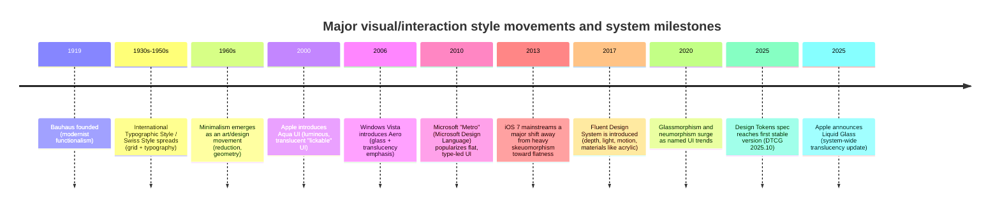

# Visual and Interaction Design Styles and Design Systems

## Executive summary

Visual/interaction “styles” and “design systems” solve different problems. A *style* is primarily an aesthetic + interaction language (what interfaces look and feel like), while a *design system* is an operating model for consistent UI at scale (standards, components, patterns, documentation, and often code). entity["organization","Nielsen Norman Group","ux research firm"] defines a design system as a complete set of standards to manage design at scale using reusable components and patterns. citeturn17search0 entity["company","Figma","design software company"] similarly frames design systems as building blocks + standards to keep product experiences consistent. citeturn17search14

Across styles, the most evidence-backed psychological pattern is that people often judge perceived usability, quality, and even credibility from *visual signals* quickly—sometimes more strongly than from actual task performance. Classic HCI studies on the aesthetic–usability effect show correlations between perceived beauty and perceived usability (e.g., ATM-like interfaces), and later work repeatedly warns that “looking usable” can mask actual usability issues in testing. citeturn7search4turn7search9turn16search15 In web credibility research, “design look” is frequently cited by users as a major factor in credibility judgments. citeturn7search25turn7search29

A recurring tradeoff across modern UI is *affordance and signifiers vs. visual reduction*. entity["people","Don Norman","cognitive scientist"] distinguishes *affordances* (possible actions) from *signifiers* (perceivable cues that communicate actions), arguing that designers must ensure people can discover what to do. citeturn15search32turn15search23 This matters because multiple studies and practitioner experiments show that weak/flat clickability cues can increase uncertainty and effort. citeturn8search3turn15search5turn8search32

Finally, modern design systems increasingly rely on interoperable “design tokens” (colors, typography scales, spacing, etc.). The entity["organization","W3C","web standards body"] Design Tokens Community Group announced a first stable Design Tokens specification (2025.10), positioning tokens as a cross-tool, cross-platform mechanism for theming and consistency. citeturn17search3turn17search23

## Scope, taxonomy, and how to use this catalog

This report treats the user’s request as three overlapping domains, because terms like “Material design” and “BEM” describe fundamentally different artifacts:

**Aesthetic and interaction styles**  
A recognizable visual language and interaction feel (e.g., skeuomorphism, brutalism, glassmorphism). Some styles have no “official spec” and exist as community terms; in those cases, authoritative practitioner syntheses (e.g., NN/g, IxDF) are used and the evidentiary status is explicitly noted. citeturn11search4turn15search10turn11search1

**Design systems and platform design languages**  
Documented standards + reusable components/patterns, often with Figma libraries and open-source code (e.g., Google Material Design, Microsoft Fluent, Apple HIG, IBM Carbon, GOV.UK Design System). citeturn14search16turn1search16turn1search18turn3search25turn14search25

**Implementation methodologies and UI architecture patterns**  
Practices for organizing UI work in design + code: component hierarchy (atomic design), CSS architecture (BEM/OOCSS/SMACSS/ITCSS), token standards, and documentation tooling (Storybook). citeturn5search1turn5search4turn6search0turn6search2turn6search3

Because there is no single canonical registry of “all UI styles,” “exhaustive” here means: a broad, rigorous catalog of widely referenced styles/systems plus notable emergent blends (e.g., neumorphism, neobrutalism, claymorphism), with clear provenance and evidence levels. citeturn11search9turn12search0turn15search25

## Timeline of major style movements

Key anchors: Bauhaus history and objectives are documented by entity["organization","The Metropolitan Museum of Art","museum new york city"]. citeturn2search5 International Typographic Style’s emergence and grid/typography hallmarks are summarized in design history sources and scholarship. citeturn2search0turn2search12 Minimalism’s emergence in the early 1960s in entity["city","New York City","new york, us"] is a standard art-history account. citeturn11search0turn11search7 Aqua was introduced by entity["company","Apple","consumer technology company"] in 2000 with luminous, semi-transparent elements. citeturn9search15 Windows Aero’s introduction with entity["company","Microsoft","technology company"] Windows Vista (2006) is documented in platform history overviews. citeturn9search2 Metro/MDL’s 2010 introduction and flat, typography-led principles are documented in design-language histories. citeturn2search3 The iOS 7 “flat shift” and de-texturing is widely reported in 2013 coverage and later retrospectives. citeturn9search18turn9news44 Fluent Design’s 2017 emergence and acrylic material guidance appear in Microsoft platform documentation. citeturn9search10turn9search3 Glassmorphism and neumorphism are treated as trends with later authoritative definitions/best practices. citeturn11search4turn15search10turn15search25 The Design Tokens milestone is announced by the W3C community group. citeturn17search3turn17search23 Liquid Glass is reported as a 2025 platform-wide Apple design language update. citeturn9news40

## Visual and interaction design styles

The entries below use a consistent structure: definition/traits; origin/history; typical use cases; practical guidelines (accessibility, responsiveness, performance, implementation/tooling); psychological and emotional associations (with empirical support where available); pros/cons/pitfalls; examples.

image_group{"layout":"carousel","aspect_ratio":"16:9","query":["iOS 6 skeuomorphic Notes app screenshot","Windows Phone 7 Metro design language screenshot","Material Design 3 components screenshot","glassmorphism UI frosted glass panel example","neumorphism soft UI buttons example","neobrutalism website UI example"],"num_per_query":1}

**Skeuomorphism**  
Definition and traits: A digital style that borrows cues from physical objects/materials (textures, shadows, stitched leather, paper, metal) to communicate meaning and interaction, often to increase familiarity. citeturn12search17  
Origin and history: Skeuomorphic UI is strongly associated with early smartphone and desktop eras, but the underlying principle—using familiar metaphors—reflects long-standing HCI practice around learnability and signifiers. citeturn15search32turn15search23  
Use cases and platforms: Onboarding novice audiences; metaphor-heavy domains (music “controls,” notebooks, calendars); some branding/marketing experiences aiming for nostalgia or tactility. citeturn12search17  
Practical guidelines: Use realistic cues only when they add clarity. Avoid heavy textures that reduce contrast or compete with content. Keep icon metaphors culturally appropriate; where metaphors are ambiguous, add textual labels. Reinforce accessibility fundamentals (contrast, focus states) regardless of realism. citeturn11search30turn10search6  
Psychological/emotional associations: Tends to feel familiar, “tangible,” and instructional (strong signifiers), potentially reducing initial cognitive friction for new users; this aligns with Norman’s emphasis on signifiers for discoverability. citeturn15search32turn15search23 Also interacts with aesthetic–usability bias: more “polished” or “real” visuals can inflate perceived usability even when task performance is unchanged. citeturn7search4turn7search9  
Pros/cons and pitfalls: Pro—strong affordance cues, emotional warmth, brand distinctiveness. Con—visual clutter, slow iteration, harder theming/dark mode, can feel dated and harm information density. Pitfall—mistaking “realistic” for “usable,” neglecting semantic structure and accessibility. citeturn8search1turn10search6  
Examples: Early iOS-era UI metaphors and “real materials” are widely cited as representative. citeturn9news44

**Skeuominimalism and “almost-flat” transitional styles**  
Definition and traits: A hybrid that keeps modern flat layouts but reintroduces selective realism—subtle gradients, shadows, and material cues—to restore signifiers and depth without full skeuomorphic texture. citeturn12search10turn12search14  
Origin and history: Emerges as a backlash to fully flat UI usability issues and as a bridge during 2010s redesign waves. citeturn15search2turn12search14  
Use cases: Mainstream product UI where clarity and brand modernity are both required; responsive web and mobile. citeturn15search5turn12search7  
Guidelines: Use depth cues to encode hierarchy and clickability (buttons, cards, elevations) consistently; test first-click behavior and compare misclicks against a flat baseline. citeturn8search3turn12search7  
Psychological associations: Often feels “clean but usable,” reducing click uncertainty seen with weak signifiers. citeturn8search3turn15search5  
Pitfalls: Inconsistent shadow language; “mushy” hierarchy when everything is slightly raised. citeturn15search5  
Examples: “Almost-flat” patterns are discussed alongside the flat-design era and its usability corrections. citeturn15search2turn12search7

**Flat design**  
Definition and traits: A style defined by the absence of glossy/3D effects; favors simple shapes, typography, color blocks, and iconography. citeturn12search1turn15search2  
Origin and history: Widely popularized in the 2010s (notably through Microsoft’s Metro/MDL and Apple’s iOS 7 shift), building on earlier modernist typography and grid traditions. citeturn2search3turn9search18turn2search0  
Use cases: Responsive web, mobile apps, dashboards where clarity and scalability matter; also common in branding and UI kits due to ease of production across screen sizes. citeturn12search4turn15search2  
Guidelines: Treat “flat” as an aesthetic, not an excuse to remove signifiers. NN/g recommends clearly differentiating clickable and non-clickable elements, using consistent affordance cues. citeturn15search5turn8search3  
Psychological associations and evidence: Flat/weak signifiers can cause “click uncertainty.” Eye-tracking experiments show weak clickability clues require more user effort. citeturn8search3 Experimental work comparing flat vs skeuomorphic approaches finds measurable differences in learnability and perception depending on the task and metaphor. citeturn8search32turn8search24  
Pros/cons: Pro—fast to render/implement, scales well, supports responsive layouts, avoids ornamental noise (aligning with minimalist heuristic goals). citeturn8search1turn12search4 Con—risk of hidden affordances, low discoverability, over-reliance on text links. citeturn15search11turn15search5  
Examples: Microsoft Design Language (“Metro”) is a canonical flat/type-led implementation. citeturn2search3

**Flat 2.0 / semi-flat**  
Definition and traits: Keeps flat simplicity while adding subtle shadows and layering to recover depth and usability cues. citeturn12search7turn15search2  
Origin: Emerges as a response to fully flat usability critiques and click uncertainty. citeturn15search5turn12search7  
Use cases: Most contemporary “mainstream” product UI on web/mobile; design systems frequently converge here because it’s compatible with accessibility and platform conventions. citeturn15search5turn11search30  
Guidelines: Define an elevation scale and use it consistently; ensure shadows do not become the *only* signifier (supplement with shape, borders, and focus indicators). citeturn11search30turn10search6  
Psychological associations: Typically perceived as modern and clean while reducing uncertainty compared with purely flat/weak-signifier patterns. citeturn8search3turn12search7  
Pitfalls: Excessive shadow stacks reduce contrast, create “dirty” seams at small sizes, and may degrade performance on low-end devices when overused in large lists. citeturn11search30turn10search16  
Examples: Described in contemporary UX writing as a “next generation” evolution of flat design. citeturn12search7turn15search2

**Minimalism in UI**  
Definition and traits: Reduce “noise” to emphasize necessary information; commonly characterized by limited UI elements, negative space, restrained palettes, and strong typography/hierarchy. citeturn8search1turn8search5  
Origin/history: Minimalism as a broader movement emerges in early 1960s visual art; UI minimalism borrows the reduction logic while adapting to interaction needs. citeturn11search0turn8search17  
Use cases: Content- and brand-forward marketing sites; simple consumer apps; flows where choice reduction aids comprehension. citeturn8search1turn8search5  
Guidelines: Minimalism must remain task-driven. NN/g’s heuristic framing stresses removing irrelevant or rarely needed information, not removing essential cues. citeturn8search1turn8search9 Validate with task success metrics: time-on-task, error rate, and findability—because minimalism can backfire if it hides options. citeturn8search1turn8search12  
Psychological associations: Often perceived as calm/premium and can reduce overload, but it can also shift cognitive effort from “seeing” to “remembering” if signifiers or navigation clarity are reduced. citeturn8search17turn15search23  
Pros/cons: Pro—visual clarity, easier responsive behavior, often good performance. Con—discoverability risk; can be culturally misread as “empty” or “unfinished” in contexts that expect density. citeturn16search13turn16search2  
Examples: NN/g documents common characteristics across 112 minimalist websites. citeturn8search5

**Maximalism in UI**  
Definition and traits: Intentional abundance—bold color, dense decoration/illustration, expressive typography, layered textures, and high visual variety. (Unlike minimalism, maximalism is less standardized in UI literature; it is typically an art/design posture and brand strategy rather than a single UI spec.) citeturn7search35turn11news45  
Origin/history: Often positioned as a counter-movement to modernist/minimalist reduction (e.g., postmodern design waves like Memphis). citeturn11news45  
Use cases: Branding, campaigns, entertainment, youth culture, and experiences where memorability and expression trump efficiency. citeturn7search25turn16search21  
Guidelines: Constrain complexity with grid and hierarchy; reserve maximalism for “hero” zones while keeping task-critical UI conventional and accessible (contrast, focus states, motion controls). citeturn11search30turn10search1turn10search6  
Psychological associations: Can feel playful, energetic, and distinctive—but may increase cognitive load and reduce perceived professionalism in some domains (e.g., finance, government), where credibility cues matter. citeturn7search25turn16search21  
Pitfalls: Visual overload, inaccessible color contrast, motion sickness risks if paired with aggressive animation. citeturn10search2turn11search30  
Examples: Memphis-inspired digital branding and UI expresses this posture. citeturn11news45

**International Typographic Style / Swiss Style influence**  
Definition and traits: Grid-based, typographic clarity, asymmetry, sans-serif type, objective presentation; heavy influence on modern UI layout systems. citeturn2search0turn2search12  
Origin/history: Developed and formalized in Switzerland during 1930s–1950s; spreads internationally as a modernist approach to information design. citeturn2search0turn2search12  
Use cases: Editorial, signage/wayfinding, enterprise UI, dashboards—anywhere alignment, readability, and systematic layout matter. citeturn2search0turn8search2  
Guidelines: Treat grid as a comprehension tool, not decoration; combine with accessible typography and contrast. citeturn2search0turn11search30  
Psychological associations: Often perceived as “orderly,” “professional,” and “trustworthy” because information architecture is legible and consistent—aligning with credibility research emphasizing “design look” and structure. citeturn7search25turn7search29  
Pitfalls: Over-rigidity; sterile tone in consumer products; insufficient accommodation for localized scripts/long strings. citeturn16search2turn16search13  
Examples: Microsoft’s Metro guidelines explicitly cite Swiss/wayfinding inspiration in some retrospectives. citeturn2search7turn2search3

**Bauhaus and functional modernism influence**  
Definition and traits: Function-first, geometric forms, integration of craft/industry; foundational for modern product and graphic design languages. citeturn2search5turn2search17  
Origin/history: Bauhaus founded in 1919 in Weimar, Germany; aimed to unify arts and reimagine industrial design. citeturn2search5turn2search17  
Use cases: Product design, identity systems, and UI where functional clarity and reduction are brand values. citeturn2search5turn8search17  
Guidelines: Use geometry and modularity to support systemization (components, tokens), not merely as a visual motif. citeturn17search23turn5search1  
Psychological associations: Signals modernity, rationality, and competence; can increase perceived seriousness in high-stakes applications. citeturn7search25turn16search21  
Pitfalls: Over-minimalization that hides actions; poor warmth/approachability in consumer contexts. citeturn15search23turn8search1  
Examples: Bauhaus history and objects are documented by major museums; many UI systems borrow its reduction principles implicitly. citeturn2search5turn2search17

**Brutalism and anti-design in digital UI**  
Definition and traits: Intentional rawness; “unadorned” or “haphazard” look; sometimes default HTML aesthetics; a reaction against polished homogenized web design. citeturn11search1turn11search6  
Origin/history: Name draws from Brutalist architecture (béton brut/raw concrete), but digital brutalism is a later, web-era movement, prominent in mid-2010s discussions and galleries. citeturn2news46turn11search6  
Use cases: Art portfolios, experimental media, indie culture, protest aesthetics, marketing stunts—contexts where “authenticity,” disruption, or anti-corporate messaging is the point. citeturn11search1turn11search6  
Guidelines: Ensure rawness does not become *inaccessibility*: keep text readable, preserve keyboard navigation, and provide hierarchy. citeturn10search6turn11search30  
Psychological associations: Can signal honesty, rebellion, and authenticity; but may also lower perceived credibility or professionalism in domains where users rely on conventional credibility cues. citeturn7search25turn16search21  
Pitfalls: Confusing information architecture, poor mobile/responsive behavior, and accessibility failures if “ugly” equals “unstyled.” citeturn10search6turn3search2  
Examples: NN/g points to early-1990s web aesthetics like Craigslist as the reference point for the “raw” brutalist feel. citeturn11search1

**Neobrutalism**  
Definition and traits: A “new brutalism” UI genre: bold colors, thick outlines, simple geometric shapes, intentionally “unfinished” or blunt elements (distinct from bare HTML brutalism). citeturn11search9  
Origin/history: Emerges as a recent trend (2020s) in product UI and creator communities, partly as an anti-homogenization response. citeturn11search9turn11search6  
Use cases: Consumer apps seeking playful differentiation; landing pages; brand-forward products. citeturn11search9turn7search25  
Guidelines: Treat bold outlines as *structure*: ensure focus indicators remain visible and not confused with borders; validate contrast and states; keep motion optional. citeturn10search6turn11search30turn10search1  
Psychological associations: Often feels energetic, youthful, and candid; may improve scannability because edges are explicit, but can be perceived as unserious for finance/medical. citeturn16search21turn7search25  
Pitfalls: Color overuse; insufficient hierarchy; accessibility regression if the palette is not contrast-checked. citeturn11search30turn10search6  
Examples: Industry definitions and examples are synthesized in NN/g’s neobrutalism review. citeturn11search9

**Glassmorphism**  
Definition and traits: Uses translucent layers with blur and light borders to mimic frosted glass; depth is communicated via overlapping sheets and background gradients/imagery. citeturn11search4  
Origin/history: A named trend crystallized in the 2020s, but draws from earlier OS translucency eras (Aqua, Aero) and modern CSS capabilities (e.g., backdrop-filter). citeturn11search4turn9search15turn9search2turn10search16  
Use cases: Consumer apps, marketing sites, media players, OS-like panels, overlays and cards where a “premium” or “futuristic” tone is desired. citeturn11search4turn10search16  
Guidelines:  
- Accessibility: translucency reduces contrast; ensure text/icon contrast remains WCAG-compliant and do not rely on background blur alone to guarantee legibility. citeturn11search30turn11search4  
- Performance: backdrop-filter can harm performance; test on low-end devices and provide fallbacks when unsupported. citeturn10search16turn10search0  
- User preferences: respect reduced-transparency and reduced-motion preferences where applicable. citeturn10search13turn10search1  
Psychological associations: Often perceived as sleek, modern, and “high-end,” but risks perceived usability issues if layers obscure hierarchy or reduce clarity. citeturn11search4turn16search15  
Pitfalls: “Pretty but unreadable;” insufficient separation between foreground and background; motion + parallax combined with glass can trigger vestibular discomfort. citeturn10search2turn11search4  
Examples: NN/g provides a definition and best-practices framing for glassmorphism and its risks. citeturn11search4

**Neumorphism** (often casually written as “neomorphism,” also “Soft UI”)  
Definition and traits: Low-contrast soft shadows and highlights make elements look extruded/embedded into a surface; often monochrome or muted palettes; tactile but subtle. citeturn15search10turn15search18  
Origin/history: A community-named trend that rose ~2019–2020 as a hybrid of minimalism + skeuomorphic depth cues; not an official standard. citeturn15search25turn15search10  
Use cases: Small-scope UI (media controls, toggles), marketing visuals, concept shots and component demos; risky for information-dense or accessibility-critical products. citeturn15search10turn11search30  
Guidelines: Neumorphism is fundamentally constrained by contrast: if you choose it, use it sparingly, increase contrast for critical text, and provide alternate/high-contrast themes. citeturn11search30turn4search21  
Psychological associations and evidence: Intends to feel soft, calm, tactile; however, empirical work has raised usability and accessibility concerns (especially for low-vision users) because subtle cues reduce discoverability. citeturn15search10turn0search2  
Pitfalls: Low contrast, unclear click targets, poor dark mode behavior, weak focus visibility. citeturn10search6turn11search30turn15search10  
Examples: Neumorphism is described in IxDF as a trend combining skeuomorphism and minimalism, with accessibility cautions. citeturn15search10

**Claymorphism**  
Definition and traits: Puffy, rounded, “clay-like” 3D objects; thick borders; soft gradients; often playful/pastel; aims to reintroduce depth more explicitly than neumorphism. citeturn12search0turn12search6  
Origin/history: A recent trend (early 2020s) discussed as an evolution branching from neumorphism. citeturn12search6turn12search16  
Use cases: Consumer apps, onboarding screens, illustrations, marketing UI; less suited to dense enterprise tooling. citeturn12search6turn16search21  
Guidelines: Treat clay elements as illustrations or emphasis objects; keep input controls conventional; watch performance (complex shadows) and ensure focus states are not masked by thick borders. citeturn10search6turn11search30  
Psychological tone: Friendly, approachable, toy-like; can increase perceived warmth but risks credibility mismatch in “serious” domains. citeturn7search25turn12search6  
Pitfalls: Overuse leading to clutter; reduced scannability; poor contrast if pastel-on-pastel. citeturn11search30turn8search1  
Examples: Claymorphism is described and illustrated in multiple UI-trend writeups. citeturn12search6turn12search0

**Aqua, Aero, and system translucency as proto-glass**  
Definition and traits: System-level translucency + luminous UI materials (gel/glass, blur, reflections), often paired with fluid animation as feedback. citeturn9search15turn9search2  
Origin/history: Apple’s Aqua was introduced publicly in 2000; Windows Aero with Vista in 2006. Both explicitly highlighted translucency as a UI feature. citeturn9search15turn9search2  
Use cases: OS and OS-like shells; modern web apps that aim to look “native”; panels, sidebars, and transient surfaces. citeturn10search16turn9search21  
Guidelines: Prefer translucency on *transient* UI surfaces and maintain readable contrast; test legibility over dynamic backgrounds; provide fallbacks for performance and reduced-transparency settings. citeturn9search3turn10search16turn10search13  
Psychological associations: “Futuristic,” “premium,” “alive,” but also historically tied to hardware demands (Aero era) and potential distraction. citeturn9search2turn7search25  
Pitfalls: High GPU cost on blur-heavy surfaces; legibility failures; excessive motion. citeturn10search16turn10search2turn10search1  
Examples: Apple’s 2000 Mac OS X press release explicitly calls out luminous and semi-transparent Aqua elements; Microsoft documentation discusses acrylic/translucent materials as hierarchy tools. citeturn9search15turn9search3

**Dark mode and theme-first UI**  
Definition and traits: A theme strategy, not a standalone “style”: darker backgrounds, adjusted contrast, and often reduced luminance; must preserve hierarchy, focus indicators, and readability. citeturn7search11turn10search6  
Origin/history: Dark UIs existed early (terminal era), but modern “dark mode” is a platform-level user preference with OS and app support; evidence suggests it can improve comfort for some users and impair legibility for others. citeturn7search11turn7search7  
Use cases: Low-light use, media apps, developer tools; optional theme toggles in most products. citeturn7search11turn4search21  
Guidelines: Don’t just invert; design a full token set (surfaces, borders, text, semantic colors). Validate contrast. Consider “high contrast” variants as GitHub does in token primitives. citeturn4search21turn11search30turn10search6  
Psychological associations and evidence: Often perceived as modern and focused; empirically, visual performance tends to be better with light mode for normal vision, while some users with certain impairments may perform better with dark mode. citeturn7search11turn7search7  
Pitfalls: “Halation” and glowing text for some users; low-contrast borders; missing focus states in dark palettes. citeturn7search11turn10search6  
Examples: NN/g summarizes tradeoffs and user groups; newer theme/workload studies continue to examine performance impacts. citeturn7search11turn7search19turn7search7

**Frutiger Aero / Web 2.0 gloss nostalgia**  
Definition and traits: Mid-2000s optimistic techno-nature aesthetic: glossy gradients, reflections, soft skeuomorphic motifs (water, grass, bubbles), often tied to Aero-era translucency and corporate clean futurism. citeturn12search2turn9search2  
Origin/history: Named retrospectively (2017) and discussed as prevalent roughly mid-2000s to early 2010s; resurged as a nostalgia aesthetic in the 2020s. citeturn12search2turn12news42  
Use cases: Branding, retrospectives, themed experiences, entertainment; not typical for productivity UI unless deliberately nostalgic. citeturn12news42turn7search25  
Guidelines: Treat as brand layer rather than core interaction system; keep modern accessibility and responsive layout practices underneath. citeturn10search6turn8search2  
Psychological associations: Nostalgic, hopeful, playful; can increase positive affect, which may increase tolerance of minor usability issues (aesthetic–usability effect). citeturn16search15turn12news42  
Pitfalls: Dated feel; heavy imagery; poor contrast if gloss overlays text. citeturn11search30turn10search16  
Examples: The style is explicitly linked to Windows Aero and early-2010s UI transitions in its retrospectives. citeturn12search2turn9search2

**Pixel/retro UI aesthetics**  
Definition and traits: Low-resolution pixel art, 8-bit/16-bit palette constraints, bitmap typography, deliberate “game UI” metaphors. (This is more of a visual motif family than a standardized UX style.) citeturn7search25turn16search21  
Origin/history: Rooted in early computing and console limitations; periodically revived. citeturn12search2  
Use cases: Games, creator tools, themed apps, marketing.  
Guidelines: Ensure pixel fonts remain readable; provide scaling and accessibility options; preserve semantic HTML structure. citeturn10search6turn3search2  
Psychological associations: Nostalgia and play; potential trust/certainty decrease for high-stakes tasks where professional cues matter. citeturn7search25turn16search21  
Pitfalls: Legibility and touch-target issues on mobile if not adapted. citeturn10search6turn3search2  
Examples: Best treated as a brand/experience layer; credibility research suggests visual design heavily influences first impressions—so use intentionally. citeturn7search25turn7search29

## Design systems and UI frameworks

**Material Design** (Google)  
Definition and traits: An adaptable system of guidelines, components, and tools supporting best practices in UI design; includes visual, interaction, and motion guidance, backed by open-source code and multi-platform component libraries. citeturn14search16turn10search31turn14search24  
Origin/history: Authored and maintained by entity["company","Google","technology company"]; evolved across versions (Material 1/2/3) with expanded color, motion, and component guidance. citeturn14search20turn10search3turn10search35  
Use cases/platforms: Android apps, cross-platform Flutter apps, and web applications; widely used for consumer apps and internal tooling. citeturn10search31turn14search8turn14search12  
Practical guidelines:  
- Motion: Material explicitly treats motion as meaningful feedback and relationship communication. citeturn10search7turn10search19  
- Accessibility: implement contrast, touch targets, and focus states; use official component libraries to inherit tested behavior. citeturn10search31turn10search6  
- Tooling: Material component stacks exist across Android, Flutter, iOS (maintenance mode noted in repos), and web components. citeturn14search24turn14search20  
Psychological associations and evidence: Often perceived as “structured,” “consistent,” and “modern.” The consistency of a design system can reduce cognitive load by stabilizing patterns; this aligns with general findings that users learn systems faster when signifiers and patterns are consistent. citeturn15search23turn3search3  
Pitfalls: “Material-by-default” sameness; overuse of motion (must respect reduced-motion preferences). citeturn10search1turn10search2  
Examples: Material 3 component documentation and repositories are canonical real-world references. citeturn14search0turn14search24

**Fluent Design System and Fluent UI** (Microsoft)  
Definition and traits: A design language emphasizing light, depth, motion, material, and scale; includes translucent “acrylic” material to add depth and hierarchy. citeturn9search10turn9search3turn1search36  
Origin/history: Introduced by Microsoft in 2017; continually evolving (Fluent 2). citeturn9search10turn1search16  
Use cases/platforms: Windows apps, Microsoft 365, cross-platform UI frameworks; web component and React stacks exist under Fluent UI. citeturn1search36turn9search21  
Practical guidelines: Acrylic is recommended for transient, dismissible surfaces; Mica for long-lived surfaces; both aim to establish hierarchy while adapting to theme. citeturn9search3turn9search21turn9search6  
Psychological associations: Translucency + depth can feel modern and “native,” but inherits glassmorphism risks (contrast, performance). citeturn10search16turn11search4turn9search3  
Pitfalls: Overuse of blur/material effects; inconsistent cross-platform rendering; accessibility regressions if blur undermines contrast. citeturn10search16turn11search30turn9search3  
Examples: Microsoft acrylic material documentation and Fluent 2 site are representative references. citeturn9search3turn1search16

**Apple Human Interface Guidelines and platform design language**  
Definition and traits: Guidance for consistent, user-friendly UI across Apple platforms; historically includes shifts from skeuomorphism to flatter designs and later renewed translucency. citeturn1search13turn9news40  
Origin/history: Apple has published HIG guidance in multiple eras; vintage and later documents show continuity of human-interface principles. citeturn1search13turn1search9  
Use cases/platforms: iOS/iPadOS/macOS/watchOS/tvOS ecosystem apps; also influences third-party apps that seek platform congruence. citeturn9news40turn1search13  
Practical guidelines: Use platform-native patterns for navigation, gestures, typography, and accessibility; when using translucency (e.g., “liquid glass” style layers), maintain legibility and leverage system APIs. citeturn9news40turn10search6  
Psychological associations: Platform consistency can increase trust and lower cognitive load—users import learned models from the OS into apps. citeturn15search23turn7search25  
Pitfalls: Chasing platform aesthetics while breaking interaction conventions; using decorative translucency without contrast discipline. citeturn10search6turn11search30  
Examples: Apple’s Aqua-era press language highlights translucency as a deliberate interaction/visual strategy; 2025 Liquid Glass is a modern continuation. citeturn9search15turn9news40

**IBM Design Language and Carbon Design System**  
Definition and traits: Carbon is IBM’s open-source design system with working code, design tools, guidelines, and accessibility targets; built on IBM Design Language foundations. citeturn14search25turn14search5turn1search14  
Origin/history: Developed by entity["company","IBM","technology company"]; Carbon documentation describes translation of design language into code and maintains Figma libraries/kits. citeturn1search18turn14search5  
Use cases/platforms: Enterprise web/product UI; React and web component implementations. citeturn14search13turn14search1  
Practical guidelines: Carbon explicitly targets WCAG AA across themes (contrast ratios for text/components) and provides accessibility guidance per component. citeturn1search34turn1search26  
Psychological associations: Enterprise tone—clarity, efficiency, consistency—supports trust in complex tools and reduces cognitive load via standard patterns. citeturn3search3turn7search25turn14search5  
Pitfalls: Customization that breaks token/contrast contracts; partial adoption (“Franken-Carbon”) leading to inconsistency. citeturn14search5turn17search22  
Examples: Carbon’s main site and React implementation are direct references. citeturn14search25turn14search1

**Salesforce Lightning Design System**  
Definition and traits: A CSS framework and component/pattern system for building UIs consistent with Salesforce Lightning Experience. citeturn14search14turn14search6  
Origin/history: Built by entity["company","Salesforce","enterprise software company"] UX; open-source repo and evolving “SLDS 2” architecture emphasize CSS custom properties and tooling support (validators/linters). citeturn14search6turn14search2turn14search37  
Use cases/platforms: Salesforce app ecosystem (web components, extensions, internal apps). citeturn14search14turn1search8  
Practical guidelines: Leverage SLDS markup/CSS for consistency; use linting tools to keep implementations future-proof; pair with Salesforce accessibility guidance for component behavior. citeturn14search37turn1search11  
Psychological associations: Familiarity is high for Salesforce users; consistent patterns can reduce training burden in enterprise workflows. citeturn7search25turn14search14  
Pitfalls: Assuming “using SLDS” equals accessibility—Salesforce and other DS teams emphasize that accessible foundations still require correct usage and testing. citeturn3search13turn1search11  
Examples: SLDS repo and official developer guidance are primary references. citeturn14search6turn14search14

**Adobe Spectrum and React Spectrum**  
Definition and traits: Spectrum provides components and principles for cohesive Adobe application experiences; React Spectrum implements Spectrum in React with accessibility goals. citeturn4search0turn4search27turn4search12  
Origin/history: Built by entity["company","Adobe","software company"]; Spectrum includes inclusive design guidance and code references. citeturn4search4turn4search8  
Use cases/platforms: Adobe products and any web products adopting Spectrum/React Spectrum; design system adoption practices documented by Adobe. citeturn4search16turn4search27  
Practical guidelines: Spectrum emphasizes readable, intuitive UI mindful of alternative inputs and screen readers and documents accessibility workflows. citeturn4search8turn4search4  
Psychological associations: Cohesion + accessibility focus can increase trust for creative/pro tools; consistent patterns reduce cognitive friction. citeturn7search25turn4search8  
Pitfalls: Mixing Spectrum and non-Spectrum patterns without token alignment; insufficient documentation of custom components. citeturn4search16turn17search2  
Examples: Spectrum site and React Spectrum repo are direct references. citeturn4search0turn4search27

**Shopify Polaris**  
Definition and traits: A design system and shared language guiding Shopify admin experiences; component reuse improves consistency and accessible markup. citeturn3search8turn3search0  
Origin/history: Built by entity["company","Shopify","ecommerce company"] for admin and app ecosystem. citeturn3search8  
Use cases/platforms: Shopify admin, Shopify apps (React and web components). citeturn3search12turn3search4  
Practical guidelines: Polaris highlights that using components improves accessibility and consistency; keep teams aligned via tokens and official components. citeturn3search0turn3search12  
Psychological associations: Merchant tooling benefits from predictable patterns and readability; reduces training and error. citeturn7search25turn3search8  
Pitfalls: Custom styling that breaks semantic meaning; relying on components but writing inaccessible content flows. citeturn3search0turn3search13  
Examples: Polaris foundations and accessibility docs are representative. citeturn3search8turn3search0

**Atlassian Design System and Atlaskit**  
Definition and traits: Component foundations and accessibility guidance; consistent patterns across collaboration products; Atlaskit provides reusable React components aligned with Atlassian guidelines. citeturn3search23turn14search11turn14search19  
Origin/history: Built by entity["company","Atlassian","software company"]; emphasizes accessibility principles and consistent experiences. citeturn3search3turn3search19  
Use cases/platforms: Atlassian products and ecosystem apps; web-focused. citeturn14search7turn14search11  
Practical guidelines: Atlassian accessibility guidance explicitly links consistency to lower cognitive load and encourages reuse of DS components. citeturn3search3  
Psychological associations: Collaboration tools rely on trust and predictability; accessible-by-default components scale inclusion. citeturn3search19turn7search25  
Pitfalls: Version drift across packages; inconsistent adoption across teams. citeturn14search29turn14search23  
Examples: Atlassian foundation pages and Atlaskit packages are the canonical references. citeturn3search23turn14search11turn14search7

**GOV.UK Design System**  
Definition and traits: A government design system to help teams build services aligned with government design principles; includes community-backed research and accessibility strategy. citeturn3search25turn3search21turn3search13  
Origin/history: Maintained by UK Government Digital Service; emphasizes that using the system does *not* automatically make a service accessible. citeturn3search25turn3search13  
Use cases/platforms: Government web services; forms and transactional flows. citeturn3search25turn3search21  
Practical guidelines: Strong emphasis on WCAG compliance and iterative accessibility work; provides strategy and accountability structure. citeturn3search13turn3search5  
Psychological associations: Government services benefit from clarity, predictability, and accessibility as trust signals; aligns with credibility research that structure and design look affect first impressions. citeturn7search25turn7search29turn3search21  
Pitfalls: Cargo-culting components without user research; failing to test with disabled users. citeturn3search13turn3search28  
Examples: GOV.UK Design System site and accessibility strategy. citeturn3search25turn3search13

**U.S. Web Design System**  
Definition and traits: A design system for the U.S. federal government; aims to make it easier to build accessible, mobile-friendly government websites; provides components and patterns. citeturn3search6turn3search35  
Origin/history: Maintained as open source with documentation and research pages. citeturn3search35turn3search22  
Use cases/platforms: Government web; high compliance needs (Section 508, WCAG). citeturn3search10turn3search2  
Practical guidelines: USWDS documentation claims alignment with WCAG AA and Section 508 and lists testing tools used. citeturn3search10turn3search2  
Psychological associations: Consistent government UI can increase trust and reduce confusion, especially for high-stakes citizen tasks. citeturn7search25turn3search6  
Pitfalls: Using components without service-level content design and IA; insufficient testing with real users. citeturn3search13turn3search2  
Examples: USWDS home, accessibility docs, and GitHub repository. citeturn3search6turn3search2turn3search35

**GitHub Primer**  
Definition and traits: A system of foundations, components, and accessibility guidance for GitHub; includes tokenized primitives and explicit accessibility modes (e.g., high contrast). citeturn4search1turn4search21turn4search9  
Origin/history: Built by entity["company","GitHub","software hosting company"]; pairs design system with organization-wide accessibility commitments. citeturn4search9turn4search13  
Use cases/platforms: GitHub product UI and developer-facing experiences. citeturn4search1  
Practical guidelines: Primer discusses how accessibility can be lost when components are misused and describes process improvements like annotations. citeturn4search5  
Psychological associations: Developer tools benefit from clarity and trust signals; high-contrast token variants support inclusive use cases. citeturn4search21turn7search25  
Pitfalls: Toasts and transient messaging patterns can be accessibility traps; Primer discussions on such patterns highlight nuanced risks. citeturn4search29  
Examples: Primer site + primitives repo. citeturn4search1turn4search21

**Bootstrap**  
Definition and traits: A widely used open-source CSS framework offering responsive layout tools and UI components; provides an accessibility overview and limitations. citeturn4search3turn4search23  
Origin/history: Adopted broadly across web development; distribution and usage documented in its ecosystem documentation. citeturn4search3turn4search23  
Use cases/platforms: Web apps and sites needing rapid scaffolding; admin and internal tools. citeturn4search23turn4search3  
Practical guidelines: Bootstrap notes accessibility depends on correct semantic markup and scripting; it can be used to meet WCAG/Section-508-like standards when correctly implemented. citeturn4search3  
Psychological associations: Familiar component patterns can reduce learning cost; but “Bootstrap look” can signal genericness unless customized. citeturn7search25turn16search21  
Pitfalls: Assuming framework components are accessible in all contexts; failing to provide correct labels, focus management, and semantics. citeturn4search3turn10search6  
Examples: Bootstrap’s official accessibility documentation. citeturn4search3

**Ant Design**  
Definition and traits: An enterprise-class design language and React UI library oriented toward business applications. citeturn4search2turn4search6turn4search25  
Origin/history: Developed within the Alibaba ecosystem (commonly attributed in third-party references; official site positions it as enterprise design language). citeturn4search2turn4search25  
Use cases/platforms: Enterprise web, dashboards, internal systems. citeturn4search6  
Practical guidelines: Ant offers design guidelines and components; however, accessibility documentation may be less centralized compared with systems like Material (some comparative reviews highlight this gap). citeturn4search25turn4search14turn4search10  
Psychological associations: “Enterprise” visual language can signal competence and seriousness; dense component sets reduce build time but can increase cognitive load if overused without hierarchy discipline. citeturn7search25turn8search12  
Pitfalls: Treating library defaults as UX strategy; insufficient accessibility auditing for complex widgets. citeturn4search10turn10search6  
Examples: Official Ant Design docs and component library. citeturn4search2turn4search6

## Design-system architecture and implementation methodologies

This section covers “systems behind the systems”: how UI is organized, coded, tokenized, and documented.

**Atomic design**  
Definition: A methodology for building interface systems via hierarchical stages (atoms → molecules → organisms → templates → pages). citeturn5search1  
Origin/history: Popularized by entity["people","Brad Frost","web designer"]; broadly used as a mental model for component libraries. citeturn5search1  
Use cases: Component library organization, design system governance, documentation navigation. citeturn5search1turn17search2  
Guidelines: Use as a flexible model, not dogma—some teams adopt modified taxonomies to better match product domains. citeturn5search33  
Psychological/organizational associations: Improves shared mental models across design/engineering by naming levels of abstraction; reduces rework when paired with documentation and tokens. citeturn17search2turn17search22  
Pitfalls: Misclassification debates; overly rigid hierarchies; pages/templates divergence from actual product routing. citeturn5search33turn17search22  
Examples: The atomic-design documentation is the canonical reference. citeturn5search21

**BEM**  
Definition: A methodology and naming convention for reusable interface components (Block–Element–Modifier), created to support fast launches and long-term maintenance. citeturn5search4turn5search0  
Origin/history: Invented at entity["company","Yandex","technology company"], with official methodology and docs maintained by Yandex/BEM community. citeturn5search4turn5search32  
Use cases: Large web codebases, multi-team CSS/JS component work, consistent naming across technologies. citeturn5search4turn5search0  
Guidelines: Keep names semantic and stable; avoid coupling styles to DOM location; use modifiers for state/variants rather than ad-hoc overrides. citeturn5search0turn5search20  
Psychological/organizational associations: Reduces cognitive overhead in code review and maintenance by making structure explicit and discoverable. citeturn5search0turn6search0  
Pitfalls: Overly verbose naming; mixing BEM with other conventions without rules. citeturn5search20turn6search0  
Examples: Official BEM docs. citeturn5search4turn5search0

**OOCSS**  
Definition: “Object-oriented CSS” organizes styles around reusable “objects/modules,” separating structure from skin and container from content. citeturn5search6turn5search10  
Origin/history: Developed by entity["people","Nicole Sullivan","frontend engineer"]; discussed in early web-performance-focused CSS architecture discourse. citeturn5search6turn5search26  
Use cases: Reuse-heavy UI, performance-sensitive CSS, teams scaling shared components. citeturn5search10turn5search6  
Guidelines: Define canonical objects (media object, layout primitives) and document usage. citeturn5search10  
Pitfalls: Too-generic abstractions that become hard to understand; lack of governance. citeturn17search22turn6search0  
Examples: Smashing Magazine introduction and early talks. citeturn5search10turn5search26

**SMACSS**  
Definition: A “style guide more than rigid framework” for categorizing and structuring CSS, written by entity["people","Jonathan Snook","web developer"]. citeturn6search0turn6search8  
Origin/history: Documented as an approach (written 2011) with flexible application. citeturn6search8  
Use cases: Teams needing conventional CSS structure without adopting a full framework. citeturn6search0  
Guidelines: Use SMACSS categories to prevent cascade chaos; keep documentation and naming consistent. citeturn6search0turn6search4  
Pitfalls: Partial adoption (file structure without naming rules); failure to enforce conventions. citeturn6search0turn17search22  
Examples: Official SMACSS site. citeturn6search0

**ITCSS**  
Definition: Inverted Triangle CSS organizes styles from generic to specific and manages specificity/cascade through layered architecture. citeturn5search19turn5search7  
Origin/history: Attributed to entity["people","Harry Roberts","web performance engineer"]; applied in large codebase scaling contexts. citeturn5search7turn5search31  
Use cases: Large multi-team CSS codebases where cascade and specificity are frequent sources of regression. citeturn5search19turn5search3  
Guidelines: Treat layers as contracts; pair with BEM or component scoping to control leakage. citeturn5search3turn5search4  
Pitfalls: Overengineering for small sites; layer confusion without strong documentation. citeturn5search23turn6search0  
Examples: Intro articles and widely cited overviews of the inverted triangle approach. citeturn5search7turn5search19

**CSS Modules**  
Definition: CSS files where class names are locally scoped by default; compiled into global CSS + mapping data. citeturn6search1  
Origin/history: A compilation approach rather than a browser standard; popular in modular JS build ecosystems. citeturn6search1turn6search25  
Use cases: Component-oriented web apps to prevent global namespace collisions. citeturn6search1  
Guidelines: Prefer semantic class names in-module; use composition intentionally; combine with tokens for consistent theming. citeturn6search1turn17search23  
Pitfalls: Build-tool coupling; confusion about global vs local styles; theming complexity without tokenization. citeturn6search25turn17search23  
Examples: Official CSS Modules documentation. citeturn6search1

**CSS-in-JS and styled-components**  
Definition: Co-locates styles with components; styled-components lets developers write CSS in JavaScript using tagged template literals and generates unique class names. citeturn13search1turn13search5  
Origin/history: Emerges from component-based UI frameworks and build tooling; styled-components is a prominent implementation with SSR guidance in modern frameworks. citeturn13search28turn13search31  
Use cases: Design systems in React ecosystems; dynamic theming; component libraries needing encapsulation. citeturn13search5turn17search22  
Guidelines: Keep separation of concerns via component boundaries; avoid mixing business logic with styling in ways that hurt reuse; audit generated CSS size and critical CSS behavior. citeturn13search5turn13search20  
Pitfalls: Vendor lock-in, runtime overhead (depending on approach), harder static analysis if not structured. citeturn13search20turn6search25  
Examples: styled-components docs and SSR guides. citeturn13search1turn13search31

**Design tokens and the DTCG specification**  
Definition: Tokens are indivisible pieces of a design system (e.g., colors, spacing, typography scale) and a file format can exchange them across tools. citeturn17search23turn17search3  
Origin/history: The DTCG announced a first stable spec (2025.10), aiming to support theming/multi-brand, modern color spaces, and cross-platform generation. citeturn17search3turn17search11  
Use cases: Multi-platform design systems; dark mode + high-contrast variants; brand portfolios; scaling consistency. citeturn17search3turn4search21  
Guidelines: Treat tokens as the single source of truth; avoid hard-coded values; establish naming conventions and governance, because tokens are a socio-technical system as much as a data file. citeturn17search2turn17search22turn17search23  
Pitfalls: Token sprawl; mixing semantic and raw tokens; lack of migration strategy. citeturn17search3turn17search22  
Examples: DTCG technical report and W3C community announcements. citeturn17search23turn17search3

**Storybook as a design-system workbench**  
Definition: A workshop for building, testing, and documenting UI components in isolation; used for UI development and documentation at scale. citeturn6search3turn6search7  
Use cases: Component libraries, visual regression, documenting states and edge cases (“living documentation”). citeturn6search7turn6search15  
Guidelines: Integrate autodocs and accessibility testing; keep component stories aligned with design tokens and Figma libraries. citeturn6search15turn17search23  
Pitfalls: Story drift from production; undocumented variants; insufficient governance. citeturn17search22turn6search7  
Examples: Storybook official docs and repo. citeturn6search7turn6search11

## Comparative table of styles and systems

The table below summarizes **visual traits**, **best contexts**, **emotional tone**, **accessibility concerns**, and **implementation complexity**. (Complexity is relative: Low/Medium/High, assuming modern web/mobile production.)

| Style / system | Type | Visual traits | Best contexts | Typical emotional tone | Key accessibility concerns | Implementation complexity |
|---|---|---|---|---|---|---|
| Skeuomorphism | Style | Real textures/materials, strong depth cues | Onboarding, metaphor-heavy UI | Familiar, tactile | Contrast under textures; distraction | High |
| Skeuominimalism / almost-flat | Style | Flat layouts + selective depth | Mainstream product UI | Clean, clear | Inconsistent signifiers; shadow-only cues | Medium |
| Flat design | Style | 2D shapes, typography-led, minimal effects | Responsive web/mobile, scalable UI | Modern, simple | Weak signifiers → uncertainty | Low–Medium |
| Flat 2.0 / semi-flat | Style | Subtle shadows/layers | Most contemporary UI | Modern, usable | Shadow contrast, focus visibility | Medium |
| Minimalism | Style | Reduced noise, negative space, restrained palette | Content/brand sites, simple apps | Calm, premium | Hidden options; reliance on recall | Medium |
| Maximalism | Style | Bold color/type, dense decoration | Campaigns, entertainment | Energetic, expressive | Contrast and motion overload | Medium–High |
| Swiss/International Typographic Style | Style influence | Grid, asymmetric layout, sans-serif clarity | Enterprise UI, editorial, dashboards | Professional, orderly | Localization length; small type risk | Medium |
| Bauhaus functionalism | Style influence | Geometry, function-first reduction | Product UI with rational tone | Serious, competent | Over-minimalization | Medium |
| Brutalism | Style | Raw/unadorned, sometimes default HTML | Experimental, anti-corporate | Rebellious, authentic | Readability, hierarchy, mobile | Low–Medium |
| Neobrutalism | Style | Bold outlines, bright blocks, “unfinished” | Brand-forward consumer UI | Playful, blunt | Contrast (esp. color blocks) | Medium |
| Glassmorphism | Style | Frosted glass layers, blur, thin borders | Premium UI, overlays | Sleek, futuristic | Contrast on dynamic backgrounds; transparency prefs | High |
| Neumorphism | Style | Soft UI, low-contrast extrusions | Small-scope controls, visuals | Soft, calm | Low contrast, unclear targets | Medium–High |
| Claymorphism | Style | Puffy 3D, thick borders, pastel | Onboarding, playful UI | Friendly | Pastel contrast, focus masking | Medium–High |
| Dark mode | Theme strategy | Dark surfaces, adapted tokens | Media/dev tools, optional theme | Focused, modern | Halation, low-contrast edges | Medium |
| Frutiger Aero / Web 2.0 gloss | Style | Glossy gradients, nature-tech motifs | Nostalgia/themed | Hopeful, nostalgic | Gloss overlays reduce legibility | Medium |
| Material Design | Design system | Bold hierarchy, motion language, components | Android/web/Flutter products | Structured, modern | Motion sensitivity; token misuse | Medium–High |
| Fluent Design | Design system | Depth + acrylic/materials + motion | Windows/M365 ecosystem | Native, polished | Blur contrast; performance | High |
| Apple HIG | Design language | Platform-native patterns, evolving visuals | Apple ecosystem apps | Familiar, premium | Over-customization breaks conventions | Medium–High |
| Carbon | Design system | Enterprise foundations + tokens + components | Enterprise web/product | Trustworthy, efficient | Must preserve WCAG AA targets | High |
| SLDS | Design system | Salesforce look/feel + CSS framework | Salesforce apps | Familiar, enterprise | Correct usage still required | Medium–High |
| Spectrum | Design system | Cohesive Adobe UI; inclusive design | Creative/pro tools | Cohesive, pro | Must document custom components | High |
| Polaris | Design system | Admin-focused patterns + components | Shopify apps/admin | Productive, clear | Misuse of components/content | Medium–High |
| GOV.UK DS | Design system | Service patterns + accessibility strategy | Government services | Trustworthy, plain | DS ≠ automatic accessibility | Medium |
| USWDS | Design system | Gov components + compliance lean | Government web | Official, clear | Compliance still needs testing | Medium |
| Primer | Design system | Tokenized primitives + accessibility | Developer tools | Functional, trustworthy | Toasts, transient UI pitfalls | Medium–High |
| Bootstrap | Framework | Responsive grid + common components | Fast scaffolding | Familiar | Depends on markup + ARIA | Medium |
| Ant Design | Framework/system | Enterprise component set | Dashboards, enterprise | “Business” | Varies; audit complex widgets | Medium–High |
| BEM | Methodology | Naming convention for components | Large CSS codebases | N/A (engineering) | Indirect: maintainability | Medium |
| Atomic design | Methodology | Component hierarchy model | DS organization | N/A (engineering) | Indirect: governance | Medium |
| Design tokens (DTCG) | Standard/method | Structured token exchange | Multi-brand/theming | N/A | Token misuse breaks contrast | High |

Evidence anchors for key table claims: flat/weak signifiers increasing uncertainty (NN/g eye-tracking). citeturn8search3turn15search5 Glassmorphism definition and accessibility risks (NN/g; WCAG contrast guidance; web.dev performance warning). citeturn11search4turn11search30turn10search16 Neumorphism cautions (IxDF) and its “neomorphism” naming ambiguity (Webflow’s usage). citeturn15search10turn15search25 Design system definitions (NN/g, Figma, Design Systems Handbook). citeturn17search0turn17search14turn17search5 DTCG stable tokens milestone (W3C). citeturn17search3turn17search23

## Cross-cutting guidelines and decision framework

Selecting a style/system is mostly a question of **user risk, task type, and operating context**. The evidence base is strongest on issues like *signifiers, credibility cues, and motion sensitivity*, and weaker on many named trends (because they are recent and defined socially rather than by standards). citeturn15search32turn7search25turn10search2turn11search4

**When to prefer highly conventional, system-led UI (e.g., Material/Fluent/Carbon/GOV.UK/USWDS)**  
Choose this path when errors are costly (finance, government services, healthcare workflows), when teams are large, or when long-term maintainability matters. Consistency and accessible defaults reduce cognitive load and scale quality. citeturn17search0turn3search21turn16search19turn4academia41

**When to use expressive styles (brutalism, neobrutalism, maximalism, retro)**  
Use them when differentiation, memorability, or cultural signaling is the *primary goal* and when user risk is low or mitigated by strong structure. Credibility research shows users weigh “design look” heavily; therefore, expressive styles must be aligned with the brand promise and user expectations of the domain. citeturn7search25turn7search29turn16search21

**Accessibility and performance guardrails that apply to almost every style**  
- **Contrast and readability**: Use WCAG contrast thresholds as a baseline; translucent or low-contrast styles (glassmorphism, neumorphism, pastel claymorphism) are especially at risk. citeturn10search6turn11search30turn11search4turn15search10  
- **Motion**: If motion is used to communicate state or spatial relationships (Material/Fluent), provide reduced-motion alternatives. WCAG 2.2 includes “Animation from Interactions” intent documentation; MDN documents prefers-reduced-motion as an explicit user preference signal. citeturn10search2turn10search1turn10search5  
- **Translucency/blur performance**: backdrop-filter can be expensive; web.dev cautions to test and provide fallbacks rather than heavy polyfills. citeturn10search16turn10search0  
- **Cultural and trust cues**: Color affects trust and preference, with differences across cultures; cross-cultural studies show color appeal can influence trust and satisfaction. citeturn16search13turn16search1turn16search9  
- **Design systems do not “auto-fix” accessibility**: GOV.UK explicitly states that using the system does not immediately make a service accessible—service teams still need research, design, development, and testing. citeturn3search13

**Implementation playbook that works across styles and systems**  
1) Start with tokenization: Move key decisions (color, type scale, spacing, elevation, motion durations) into a token structure aligned with the Design Tokens spec to reduce drift across platforms and themes. citeturn17search3turn17search23  
2) Encode signifiers as contracts: Define what “clickable” looks like (shape, border, shadow, cursor, focus ring, pressed states) and test that contract with first-click and eye-tracking style methods when possible. citeturn8search3turn15search23  
3) Document as living system: Pair Figma libraries with code libraries and Storybook (or equivalent) so states/edge cases are visible; treat docs as the “instruction manual,” as design system thought leaders emphasize. citeturn6search7turn17search2turn17search5  
4) Measure both perception and performance: Because aesthetic–usability bias can mask problems, combine preference/5-second tests with task success and behavioral metrics. citeturn16search15turn7search4turn7search9  
5) Build accessibility into the pipeline: Use component-level accessibility guidance (Carbon, Polaris, Atlassian, Primer), automated checks, and human audits; accessible components still require correct composition in real flows. citeturn1search34turn3search0turn3search3turn4search5turn3search13