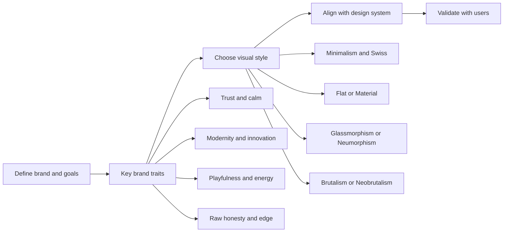

Below is a research‑based overview of major UI/visual design styles and systems, with focus on when, where, and why to use each, and their typical psychological and emotional associations.

---

## 1. Big picture: how to choose a style or system

**Key idea:** Style and system are different layers.

- A **visual style** (skeuomorphism, minimalism, brutalism, etc.) is an aesthetic and interaction philosophy.
- A **design system** (Material, Apple HIG, Polaris, Carbon, etc.) is a reusable system of components, patterns, and guidelines that often *embodies* a particular style.

To choose, you want to match:

1. **Brand personality** (playful vs serious, friendly vs expert, etc.)
2. **User expectations & context** (B2B app vs art portfolio, startup vs bank)
3. **Functional requirements** (density of information, accessibility needs)
4. **Psychological goals** (trust, calm, energy, novelty, etc.)

A quick map:

---

## 2. Core visual styles (what you asked for)

### 2.1 Skeuomorphism

**What it is**

- Design that mimics real‑world materials and objects (leather, wood, paper, buttons, switches) with realistic textures, shadows, and 3D effects.
- Early iOS (iPhone OS 1–6) is the canonical example: Notes with lined paper, Calendar with leather stitching, etc.【turn0search1】【turn0search2】

**Why/when it emerged**

- Popular in early mobile UIs (late 2000s–early 2010s) to **make digital interfaces feel familiar** to non‑technical users by borrowing physical metaphors.【turn0search1】【turn0search2】

**Psychology & emotions**

- **Familiarity & comfort:** Physical metaphors leverage existing mental models (“this is a button, I can press it”) and can improve learnability, especially for first‑time users.【turn0search1】【turn1search10】
- **Nostalgia & warmth:** Realistic textures can evoke emotional connections to physical objects (e.g., a leather‑bound notebook).【turn0search1】
- **Perceived affordances:** Strong visual cues about how to interact (e.g., raised buttons) can make interfaces feel more intuitive; studies show skeuomorphic icons can improve findability for some users, though flat designs can perform similarly on clickability.【turn0search2】【turn3search0】

**Downsides**

- Can feel **cluttered or outdated** if overused.
- Excessive realism can hurt readability and adaptability, especially on high‑density screens.【turn0search2】

**When to use**

- Onboarding or products for **less tech‑savvy audiences** where familiarity matters.
- Brands that want to feel **warm, craft‑oriented, or nostalgic**.
- As **accent elements** (e.g., a single skeuomorphic icon or illustration) rather than a full UI.

**Avoid**

- Data‑dense enterprise tools where realism adds noise.
- Products targeting very design‑savvy, “minimalist” audiences.

---

### 2.2 Flat Design

**What it is**

- A minimalist style: **no** bevels, gradients, shadows, or textures; pure color, simple shapes, clean typography.【turn1search6】【turn1search7】
- Popularized in the early 2010s (Windows 8, iOS 7) as a reaction against skeuomorphism.【turn1search5】【turn1search6】

**Why it emerged**

- Response to skeuomorphic “clutter” and a desire for **cleaner, more scalable, performance‑friendly** interfaces.【turn1search6】【turn1search9】

**Psychology & emotions**

- **Clarity & efficiency:** Less visual noise can make information easier to scan, especially for expert users.【turn1search6】【turn1search7】
- **Modernity & simplicity:** Flat design often signals “up‑to‑date” and “efficient” to users.【turn1search5】【turn1search9】
- **Risk:** Over‑flat designs with weak signifiers can hurt affordance and increase errors, especially for older users.【turn3search1】【turn1search6】

**When to use**

- Content‑heavy sites where **readability and speed** are key (news, blogs, documentation).
- Apps needing **fast load times** and responsive scaling (few heavy textures).【turn1search8】【turn1search9】
- Brands that want a **neutral, modern, “design‑y”** look.

**Avoid**

- Complex tools where users need strong visual cues to understand interactivity.
- Products where emotional warmth or tactile quality is core to the brand.

---

### 2.3 Minimalism

**What it is**

- A broader design philosophy: **reduce to the essential**; limit colors, shapes, and elements while maintaining functionality.【turn1search2】【turn1search3】
- Common in UI, product, and architecture.

**Psychology & emotions**

- **Calm & control:** Minimalist environments reduce visual noise and can lower cognitive load, which feels calming and helps people focus.【turn1search1】【turn3search7】【turn3search8】
- **Trust & professionalism:** Clean, simple designs are often perceived as more trustworthy and professional, especially in Western cultures.【turn3search9】【turn3search11】
- **Potential coldness:** Can feel sterile or “empty” if not balanced with warmth (microcopy, subtle motion, etc.).【turn1search2】【turn1search3】

**When to use**

- Tools where **focus and productivity** are central (dashboards, editors, productivity apps).
- Premium or “quiet luxury” brands where restraint signals quality.
- Situations where you want to **reduce stress** (e.g., wellness, mental health apps).【turn1search1】【turn1search3】

**Avoid**

- Brands that are playful, loud, or maximalist.
- Products that need rich, immersive emotional worlds (e.g., games, some entertainment).

---

### 2.4 Neumorphism (Neomorphism)

**What it is**

- A blend of skeuomorphism and flat design: soft, extruded plastic‑like shapes with **subtle shadows and highlights**, creating an almost “soft‑touch” 3D look.【turn0search5】【turn0search9】
- Popularized around 2019–2020 on Dribbble; Apple’s “new materials” like “Liquid Glass” push similar soft‑material ideas.【turn0search6】【turn1search16】

**Why it emerged**

- A reaction to flat design’s plainness: designers wanted **depth and tactility** but with a modern, minimal aesthetic.【turn0search5】【turn0search9】

**Psychology & emotions**

- **Tactility & modernity:** The soft, raised look feels “touchable” and contemporary, suggesting a futuristic yet gentle interface.【turn0search5】【turn0search6】
- **Subtlety & calm:** Because shadows are soft and low‑contrast, the overall feel is muted rather than aggressive.
- **Accessibility concerns:** Weak contrast between element and background can hurt visibility and usability for people with low vision.【turn0search8】

**When to use**

- Concept designs, portfolios, or apps where **visual impact and trendiness** are important.
- Brands that want a **futuristic, soft, friendly** personality (e.g., some productivity or health tools).

**Avoid**

- Data‑dense or critical interfaces where **strong affordances and clarity** are essential.
- Products with strict accessibility requirements unless you carefully test and adjust contrast.【turn0search8】

---

### 2.5 Glassmorphism

**What it is**

- UI style using **translucent, frosted‑glass panels** with background blur, semi‑transparent fills, and subtle borders to create depth and hierarchy.【turn0search10】【turn0search11】
- Popularized around 2020–2021 in macOS Big Sur, Windows 11, and Apple’s recent “Liquid Glass” language.【turn0search10】【turn0search13】

**Why it emerged**

- Big tech wanted a **fresh, modern material** that added depth without heavy gradients or old‑school gloss, and that could sit on top of complex backgrounds (gradients, photos).【turn0search10】【turn0search13】

**Psychology & emotions**

- **Lightness & modernity:** Transparency and blur feel airy and up‑to‑date; users often associate them with premium tech products.【turn0search10】【turn0search12】
- **Depth & hierarchy:** Layers of glass help organize content without heavy shadows, which can feel more elegant.
- **Potential for visual noise:** If overused, glass layers can make text readability and legibility worse, especially on busy backgrounds.【turn0search10】

**When to use**

- Apps that want a **premium, modern feel**, especially on platforms where OS UI already uses glass (Apple ecosystem, Windows 11).【turn0search10】【turn0search13】
- Interfaces with **rich backgrounds** (images, gradients) where you still want readable overlays.

**Avoid**

- Text‑heavy, information‑dense screens where readability is critical.
- Products targeting users with low vision or high‑accessibility needs, unless you rigorously test contrast and blur.

---

### 2.6 Brutalism (Web / Digital Brutalism)

**What it is**

- A raw, minimal style: **exposed grids, system fonts, heavy borders, simple colors**, often deliberately “ugly” or reminiscent of early 90s web.【turn0search17】【turn0search19】
- Inspired by brutalist architecture (béton brut – raw concrete).【turn0search17】【turn0search19】

**Why it emerged**

- Reaction against “sleek, cookie‑cutter” templates and over‑polished design; it celebrates **rawness, honesty, and DIY culture**.【turn0search17】【turn0search19】

**Psychology & emotions**

- **Honesty & integrity:** By showing structure and avoiding decoration, brutalism can feel genuine and transparent.【turn0search16】【turn0search19】
- **Curiosity & distinctiveness:** Its unconventional look grabs attention and can make a site memorable; it breaks norms on purpose.【turn0search16】【turn0search18】
- **Polarizing:** Some users find it harsh, “uncomfortable,” or even unprofessional; others love its boldness.【turn0search16】【turn0search19】

**When to use**

- Portfolios, studios, and agencies that want to **stand out and signal creativity**.
- Cultural or editorial projects where **anti‑conformist attitude** aligns with the brand.

**Avoid**

- Mainstream e‑commerce, banking, or healthcare where trust and convention matter.
- Products where usability and readability must be extremely robust for non‑expert users.

---

### 2.7 Neobrutalism (Neo‑Brutalism)

**What it is**

- A more digital‑native evolution of brutalism: **bold colors, black borders, drop shadows, exaggerated shapes**, but still raw and playful.【turn2search0】【turn2search1】
- Maintains the “unpolished” feel but with more color and friendliness.

**Why it emerged**

- A response to both brutalism’s harshness and minimalism’s sameness: designers wanted something **fun, bold, and memorable**.【turn2search0】【turn2search1】

**Psychology & emotions**

- **Energy & confidence:** Strong colors and heavy shapes feel energetic and opinionated.
- **Playfulness & approachability:** Compared to brutalism, neobrutalism is more cheerful and inviting.【turn2search0】【turn2search4】
- **Potential for overwhelm:** Can quickly feel chaotic if hierarchy isn’t controlled.【turn2search0】

**When to use**

- Startups and products targeting **younger, design‑savvy audiences**.
- Landing pages where **impact and memorability** matter more than long‑term usability.

**Avoid**

- Complex SaaS tools with many workflows; the style can compete with information.
- Brands where seriousness and stability are core values.

---

### 2.8 Swiss Style (International Typographic Style)

**What it is**

- A graphic design movement from the mid‑20th century: **grid‑based layouts, sans‑serif type, asymmetric composition, and objective photography**.【turn2search6】【turn2search9】
- Has deeply influenced modern web and UI design.

**Why it matters for UI**

- Provides the **foundation for many modern UI grids and typography systems** (including many design systems).【turn2search5】【turn2search8】

**Psychology & emotions**

- **Clarity & rationality:** Strong grids and clean typography communicate order and professionalism.【turn2search6】【turn2search9】
- **Trust & neutrality:** Objective, structured layouts often feel trustworthy and authoritative (common in news, finance, corporate).【turn2search6】【turn2search9】

**When to use**

- Editorial sites, dashboards, and corporate tools where **credibility and clarity** are paramount.
- Any project where you want a **neutral, design‑literate** foundation.

**Avoid**

- Brands that need to feel playful or experimental (Swiss style can feel “too sober”).

---

## 3. Design systems (platform/company level)

These are not “styles” in the same sense, but they’re often what people mean by “design system” in practice.

### 3.1 Google Material Design

**What it is**

- A design system by Google with guidelines, components, and tools for Android, iOS, Flutter, and web.【turn4search11】【turn4search13】
- Based on the metaphor of **“paper and ink”** with realistic lighting, shadows, and motion.【turn1search12】【turn4search11】

**Key ideas**

- Uses **tactile attributes** (elevation, shadows) to convey affordance and hierarchy.【turn1search12】【turn4search14】
- Motion is meaningful, not decorative: it helps users understand spatial relationships.【turn4search11】

**Psychology & emotions**

- **Familiarity & predictability:** Physical metaphors help users understand how elements behave.【turn1search12】
- **Trust & coherence:** Consistent patterns across apps reduce cognitive load and build trust.【turn4search11】【turn4search13】

**When to use**

- Multi‑platform apps where you want a **unified, modern, and slightly playful** personality.
- Teams that want a **ready‑made, well‑documented system**.

---

### 3.2 Apple Human Interface Guidelines (HIG)

**What it is**

- Apple’s guidelines for designing across iOS, macOS, watchOS, tvOS, and visionOS.【turn1search15】【turn1search18】
- Historically associated with **skeuomorphism**, now more minimalist with depth and motion (including the new “Liquid Glass” material).【turn1search16】【turn0search10】

**Key ideas**

- Emphasis on **clarity, deference, and depth** (content first, UI second).【turn1search15】【turn1search19】
- Strong focus on **accessibility and platform consistency**.

**Psychology & emotions**

- **Quality & refinement:** Apple’s design language signals premium, polished products.
- **Ease & confidence:** Clear, consistent patterns help users feel competent and in control.

**When to use**

- Any product heavily tied to Apple’s ecosystem (iOS/macOS apps).
- Brands that want to feel **premium, simple, and human**.

---

### 3.3 Microsoft Fluent Design System

**What it is**

- Microsoft’s design system for Windows and cross‑platform apps; built around **light, depth, motion, material, and scale**.【turn2search10】【turn2search14】

**Key ideas**

- Uses **layers and translucency** (including acrylic and “mica” materials) to create depth and visual hierarchy.【turn2search10】【turn2search12】
- Motion and connected animations help users understand transitions.【turn2search13】

**Psychology & emotions**

- **Modernity & coherence:** Fluent aims to reduce cognitive load by providing consistent, coherent experiences.【turn2search14】
- **Approachability:** Light, motion, and material can make complex software feel more accessible.

**When to use**

- Windows apps or products that want to feel **modern and Microsoft‑aligned**.
- Enterprise tools where depth and motion help explain complex workflows.

---

### 3.4 Shopify Polaris

**What it is**

- Design system for Shopify’s admin and partner experiences; includes components, patterns, content, and voice/tone guidelines.【turn2search18】【turn2search17】

**Key ideas**

- Principles like **clarity, efficiency, consistency, and innovation** for enterprise‑grade experiences.【turn4search8】
- Strong focus on **plain language and action‑oriented content**.【turn2search17】

**Psychology & emotions**

- **Empowerment & confidence:** Direct, helpful copy helps merchants feel capable.【turn2search17】【turn2search15】
- **Trust & reliability:** Consistent, professional UI builds trust for business‑critical tools.【turn4search8】

**When to use**

- E‑commerce admin or similar B2B tools where **clarity and efficiency** are key.
- Projects where **content design and voice** matter as much as visual design.

---

### 3.5 IBM Carbon Design System

**What it is**

- IBM’s open‑source design system with components, patterns, and design guidelines, based on the IBM Design Language.【turn4search0】【turn4search1】

**Key ideas**

- Focus on **clarity, efficiency, and consistency** for complex enterprise software.【turn4search3】【turn4search1】

**Psychology & emotions**

- **Expertise & trust:** A neutral, structured system conveys seriousness and reliability for business‑critical contexts.【turn4search1】【turn4search3】

**When to use**

- Enterprise and B2B products where **professionalism and clarity** are essential.
- Projects that need a **rigid, scalable component library**.

---

### 3.6 Salesforce Lightning Design System

**What it is**

- Salesforce’s design system for CRM experiences; emphasizes **clarity, efficiency, consistency, and innovation**.【turn4search6】【turn4search8】

**Psychology & emotions**

- **Productivity & confidence:** Familiar patterns help users complete tasks efficiently.【turn4search6】【turn4search8】
- **Trust & familiarity:** Consistency across Salesforce experiences builds trust over time.

**When to use**

- Apps built on Salesforce or needing tight integration with its ecosystem.
- Enterprise contexts where **workflow efficiency** is critical.

---

## 4. Psychological & emotional associations (summary table)

This is a synthesis from multiple sources on design, aesthetics, and credibility.【turn0search1】【turn1search1】【turn1search3】【turn3search0】【turn3search8】【turn0search16】【turn0search19】【turn2search6】【turn2search9】

| Style / System      | Typical Emotional Feel                     | Best‑Fit Contexts                                      | Risks / Cautions                              |
|---------------------|--------------------------------------------|--------------------------------------------------------|-----------------------------------------------|
| Skeuomorphism       | Familiar, warm, nostalgic, tactile        | Onboarding, non‑technical users, craft/heritage brands | Can feel dated or cluttered; heavy textures   |
| Flat Design         | Modern, clean, efficient, neutral         | Content sites, simple tools, modern brands             | Weak affordances; can feel cold or generic    |
| Minimalism          | Calm, clear, focused, professional        | Productivity tools, premium brands, wellness apps      | Can feel sterile or lacking personality       |
| Neumorphism         | Soft, futuristic, modern, subtle          | Concept apps, modern friendly brands                   | Accessibility issues; weak contrast           |
| Glassmorphism       | Light, modern, premium, airy              | OS‑aligned apps, immersive UI, creative tools          | Readability issues; overuse can look messy    |
| Brutalism           | Raw, honest, bold, unconventional         | Portfolios, cultural sites, agencies                   | Polarizing; can feel unprofessional           |
| Neobrutalism        | Playful, bold, energetic, young           | Startups, creative tools, landing pages                | Can overwhelm if hierarchy isn’t clear        |
| Swiss Style         | Rational, clear, trustworthy, objective   | Editorial, corporate, dashboards, finance              | Can feel too sober or conservative            |
| Material Design     | Friendly, consistent, structured, modern  | Multi‑platform apps, Google‑aligned products           | Can feel generic if not customized            |
| Apple HIG           | Premium, simple, human, refined           | Apple‑ecosystem apps, consumer products                | Requires discipline to match platform         |
| Fluent Design       | Modern, coherent, approachable, light     | Windows apps, enterprise tools with complex workflows  | Depth effects can hurt performance if overused |
| Polaris / Carbon / Lightning | Reliable, efficient, trustworthy, expert | Enterprise, B2B, e‑commerce admin, complex workflows   | Can feel “corporate” if not balanced with brand |

---

## 5. How to choose (practical framework)

1. **Start with brand and user goals, not trends.**
   - What do you want users to feel? (Trust, calm, excitement, curiosity.)
   - What do users expect in this category? (Bank vs game vs portfolio.)

2. **Match style to brand personality.**
   - Trust & calm → Minimalism, Swiss, Flat, Material, Carbon, Polaris.
   - Modern & innovative → Glassmorphism, Neumorphism, Material, Fluent.
   - Playful & bold → Neobrutalism, colorful Flat or Material.
   - Raw & honest → Brutalism, Neobrutalism, Swiss.

3. **Use design systems to enforce consistency, especially at scale.**
   - Pick a system that fits your platform and personality (Material for Android, HIG for Apple, Fluent for Windows, etc.), then customize on top of it.

4. **Always test with real users.**
   - Psychological reactions are culturally and individually variable. What feels “calm” to one group might feel “boring” to another.【turn3search9】【turn3search12】

---

If you want, I can next:

- Build a **style quiz** (“pick your brand traits, I’ll suggest 2–3 candidate styles”), or  
- Do a **deep dive on one style** (e.g., “how to do glassmorphism accessibly and responsibly”).